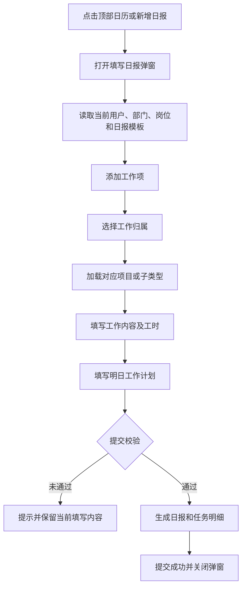

# 新增日报功能 PRD

## 1. 文档信息

| 项目 | 内容 |
|---|---|
| 产品名称 | HubX 内部 OA |
| 功能模块 | 日报管理 / 新增日报 |
| 文档版本 | V1.0 |
| 文档日期 | 2026-07-16 |
| 文档状态 | 待评审 |
| 适用端 | Web 管理端 |

## 2. 背景

公司员工的工作可能归属于客户开发项目、内部运营项目、软件或移民售前、推广及电商业务。当前需要通过统一的日报入口记录员工每天的工作内容和工时，并将每条工作项关联到明确的业务归属和项目，以支持后续项目成本、线索成本、运营成本及人员投入分析。

日报项目中的运营、移民售前、推广、电商子类型由“日报配置 > 日报项目配置”统一维护，新增日报时只读取已启用的配置项。

## 3. 产品目标

1. 为员工提供统一、易发现的日报填写入口。
2. 自动带出撰写人、部门、岗位和当天日期，降低重复填写成本。
3. 支持一份日报添加多条工作项，并分别记录归属、内容和工时。
4. 通过“工作归属 + 关联项目”建立日报任务与业务对象之间的关联。
5. 将日报工时转换为标准任务明细，为后续费用和人工成本核算提供数据基础。
6. 通过必填校验和工时校验提升日报数据质量。

## 4. 非目标

本期不包含以下能力：

- 日报草稿保存。
- 离线填写。
- 提交后的日报编辑和撤回。
- 日报审批流程。
- 日报附件上传。
- 自动从第三方系统同步工作内容。
- 日报项目配置的批量导入和导出。

## 5. 用户角色

| 角色 | 权限与职责 |
|---|---|
| 普通员工 | 填写并提交本人日报，查看本人可见的项目和业务归属 |
| 部门负责人 | 查看团队日报，关注工时、风险和需协助事项 |
| 日报管理员 | 在日报配置中维护岗位工作性质和日报项目配置 |
| 财务/管理层 | 使用日报任务明细进行项目及业务成本统计 |

## 6. 功能入口

### 6.1 顶部日历入口

- 用户点击系统顶部的日历图标，打开“填写日报”弹窗。
- 当用户存在未提交日报提醒时，日历入口显示提醒标识。

### 6.2 日报列表入口

- 页面路径：`日报 > 日报列表`。
- 用户点击列表右上角“新增日报”，打开与顶部日历入口完全一致的“填写日报”弹窗。
- 两个入口必须复用相同的用户信息、模板、初始化、校验和提交逻辑。

## 7. 核心流程

## 8. 页面结构

### 8.1 弹窗基础信息

弹窗标题为“填写日报”，底部操作为“取消”和“提交日报”。

顶部固定展示以下四项信息：

| 字段 | 数据来源 | 是否可编辑 | 规则 |
|---|---|---|---|
| 日期 | 系统当前日期 | 否 | 格式为 `YYYY-MM-DD` |
| 撰写人 | 当前登录用户 | 否 | 无用户信息时显示“未知用户” |
| 部门 | 当前用户所属部门 | 否 | 无数据时显示“未知部门” |
| 岗位 | 当前用户岗位 | 否 | 无数据时显示“未知岗位” |

### 8.2 工作项区域

- 一份日报支持添加多条工作项。
- 每条工作项独立记录工作归属、关联项目、工作内容和工时。
- 用户可以删除尚未提交的工作项。
- 不同岗位或工作项类型可以展示不同的补充字段。

### 8.3 公共补充信息

| 字段 | 是否必填 | 说明 |
|---|---|---|
| 需协助事项 | 否 | 记录需要负责人或其他部门协助的事项 |
| 今日总结 | 否 | 通用日报可使用 |
| 遇到的问题 | 否 | 开发或通用日报可使用 |
| 风险/异常反馈 | 否 | 销售工作项可按条填写 |
| 明日工作计划 | 是 | 所有日报模板均必须填写 |

## 9. 工作归属设计

### 9.1 一级工作归属

工作归属下拉框固定包含以下六项，顺序不可变：

1. 开发
2. 运营
3. 软件售前
4. 移民售前
5. 推广
6. 电商

### 9.2 二级关联项目

用户选择一级工作归属后，系统加载对应的二级项目或业务子类型。

| 一级工作归属 | 二级数据来源 | 默认处理 |
|---|---|---|
| 开发 | 项目管理中进行中的外部开发项目 | 用户选择具体项目 |
| 运营 | 日报配置 > 日报项目配置 > 运营 | 默认选中排序第一的启用项目 |
| 软件售前 | 当前可用的软件售前线索 | 用户选择具体线索 |
| 移民售前 | 日报配置 > 日报项目配置 > 移民售前 | 默认选中排序第一的启用项目 |
| 推广 | 日报配置 > 日报项目配置 > 推广 | 默认选中排序第一的启用项目 |
| 电商 | 日报配置 > 日报项目配置 > 电商 | 默认选中排序第一的启用项目 |

### 9.3 日报项目默认配置

#### 运营

- 人员招聘
- 工资核算
- 行政管理
- 报销审批
- 财务管理
- 运营推广
- 企业活动
- 培训
- 内部会议
- 其他

#### 移民售前

- 俄罗斯移民
- 新加坡移民

#### 推广

- IP打造
- 代运营
- 其他

#### 电商

- 微商城
- 助农电商

### 9.4 联动规则

1. 切换一级工作归属时，清空上一个类型的二级选择。
2. 对运营、移民售前、推广、电商，系统读取对应类型下状态为“启用”的项目。
3. 项目按照“排序”从小到大展示；排序相同时按项目名称排序。
4. 已停用的项目不出现在新增日报中，但不影响历史日报展示。
5. 配置类型没有可用项目时，二级下拉框显示空状态，当前工作项不可提交。
6. 管理员新增、编辑、启停配置后，新打开的日报立即读取最新配置。

## 10. 日报项目配置

页面路径：`日报 > 日报配置 > 日报项目配置`。

### 10.1 页面布局

- 页面分为左右两部分。
- 左侧显示：运营、移民售前、推广、电商。
- 默认选中“运营”。
- 右侧显示当前类型的项目配置列表。

### 10.2 列表字段

| 字段 | 说明 |
|---|---|
| 项目名称 | 日报填写时展示的二级项目名称 |
| 状态 | 启用或停用，支持直接切换 |
| 排序 | 正整数，数字越小越靠前 |
| 操作 | 编辑、删除；系统默认项目只能停用 |

### 10.3 新增和编辑

| 字段 | 是否必填 | 规则 |
|---|---|---|
| 业务类型 | 是 | 自动使用左侧当前类型，不支持修改 |
| 项目名称 | 是 | 最多 30 个字符，同一类型内不可重名 |
| 启用状态 | 是 | 默认启用 |
| 排序 | 是 | 正整数，默认使用当前类型最大排序值加 1 |
| 备注 | 否 | 最多 100 个字符，仅在配置列表辅助展示 |

## 11. 工作项类型及字段

统一日报支持按业务需要新增以下工作项：

| 工作项类型 | 主要字段 |
|---|---|
| 线索相关 | 工作归属、关联项目/线索、工作内容、工时 |
| 项目相关 | 工作归属、关联项目、工作内容、工时 |
| 新媒体投放 | 工作归属、关联项目、渠道、账户、消耗金额、总客资数、有效客资数、工作内容、工时 |
| 新媒体内容 | 工作归属、关联项目、渠道、内容数量、工作内容、工时 |
| 招聘 | 工作归属、关联项目、招聘岗位、招聘阶段、候选人数、面试人数、工作内容、工时 |
| 管理工作 | 工作归属、关联项目、管理事项、工作内容、工时 |
| 其他 | 工作归属、关联项目、工作内容、工时 |

销售、开发和通用岗位可根据岗位模板展示更聚焦的字段，但必须保留工作归属、关联对象、工作内容和工时四项核心数据。

## 12. 提交校验

### 12.1 通用校验

1. 明日工作计划不能为空。
2. 至少存在一条有效任务明细。
3. 有效任务必须选择工作归属及对应的关联项目或子类型。
4. 有效任务工时必须大于 0。
5. 单份日报总工时不得超过 24 小时。
6. 总工时超过 12 小时时，弹出二次确认；用户取消后保留当前内容。

### 12.2 工作项专项校验

| 工作项类型 | 校验要求 |
|---|---|
| 销售工作项 | 工作性质、工作内容、工时必填 |
| 线索相关 | 关联线索、工作内容、工时必填 |
| 项目相关 | 关联项目、工作内容、工时必填 |
| 新媒体投放 | 渠道、账户、工作内容、工时必填 |
| 新媒体内容 | 渠道、数量、工作内容、工时必填 |
| 招聘 | 招聘岗位、招聘阶段、工作内容、工时必填 |
| 管理工作 | 管理事项、工作内容、工时必填 |
| 其他 | 工作内容、工时必填 |

### 12.3 校验反馈

- 校验失败时不关闭弹窗，不清空已填写数据。
- 使用明确的中文提示，例如“请选择工作归属”“请填写明日工作计划（必填）”。
- 提交成功后提示“日报提交成功”，关闭弹窗并清理本次会话数据。

## 13. 提交结果与数据归集

提交后生成一条日报主记录和多条标准任务明细。

### 13.1 日报主记录

| 字段 | 说明 |
|---|---|
| id | 日报唯一标识 |
| userId / userName | 提交人 |
| department | 提交人部门 |
| reportDate | 日报日期 |
| templateId / templateType | 使用的日报模板 |
| content | 原始表单内容 |
| status | 提交后为 `submitted` |
| createdAt / updatedAt | 创建和更新时间 |

### 13.2 任务明细

| 字段 | 说明 |
|---|---|
| workAttributionCategory | 一级工作归属 |
| workAttributionType | 底层关联类型 |
| relationType | 项目、线索或运营事项 |
| relationId / relationName | 关联对象 |
| workKind | 工作性质或标准工种 |
| content | 工作内容及补充数据 |
| hours | 本工作项工时 |
| costBucket | 成本归集口径 |

### 13.3 费用归集口径

| 工作归属 | 归集对象 | 默认成本口径 |
|---|---|---|
| 开发 | 外部开发项目 | 项目成本 |
| 运营 | 内部运营项目 | 内部项目成本 |
| 软件售前 | 软件线索 | 售前线索成本 |
| 移民售前 | 移民业务项目 | 售前线索成本 |
| 推广 | 推广项目 | 运营成本 |
| 电商 | 电商项目 | 运营成本 |

后续费用计算可使用“员工标准时薪 × 工作项工时”得到人工成本，并按 `relationId` 汇总到对应项目或业务子类型。

## 14. 状态与异常处理

| 场景 | 页面行为 |
|---|---|
| 当前用户不存在 | 撰写人、部门、岗位显示未知信息，提交时保留用户 ID |
| 二级项目为空 | 显示空下拉框，提交时提示选择工作归属 |
| 配置项目已停用 | 新日报不再展示，历史日报继续显示原名称 |
| 网络或服务端提交失败 | 保留弹窗和当前内容，提示提交失败原因 |
| 用户点击取消或关闭 | 关闭弹窗；本期不保存草稿 |
| 重复点击提交 | 提交过程中按钮进入加载态，禁止重复提交 |

## 15. 权限要求

1. 普通员工只能以当前登录账号填写日报，不可修改撰写人、部门和岗位。
2. 日报项目配置仅对具备日报配置权限的管理员开放。
3. 用户只能选择其有权访问的项目、线索及业务配置项。
4. 停用和删除配置不得修改历史日报任务数据。

## 16. 非功能要求

- 弹窗最大宽度适配桌面端，窄屏下保留至少 16px 页面边距。
- 工作项增删和归属切换应即时响应，不出现整页刷新。
- 新打开弹窗时必须使用全新会话数据，不得残留上一次填写内容。
- 日报项目配置更新后，新打开弹窗应读取最新数据。
- 所有选择项和提示文案使用中文。
- 提交接口应具备幂等处理能力，防止重复日报或重复任务明细。

## 17. 数据指标

建议上线后跟踪以下指标：

- 日报按时提交率。
- 日报有效工作项数量。
- 人均日报填写耗时。
- 工作归属和关联项目完整率。
- 超过 12 小时的日报占比。
- 各业务归属工时占比。
- 各项目累计人工工时和人工成本。
- 因配置为空导致的提交失败次数。

## 18. 验收标准

1. 顶部日历和日报列表“新增日报”打开同一个填写弹窗。
2. 每次打开弹窗时，日期、撰写人、部门、岗位正确显示且不可编辑。
3. 工作归属严格按开发、运营、软件售前、移民售前、推广、电商的顺序展示。
4. 选择运营后，二级下拉框展示运营配置中的启用项目。
5. 选择移民售前后，默认可选择俄罗斯移民、新加坡移民。
6. 选择推广后，默认可选择IP打造、代运营、其他。
7. 选择电商后，默认可选择微商城、助农电商。
8. 配置项停用后，不再出现在新打开的日报中。
9. 配置项排序修改后，日报二级下拉框顺序同步变化。
10. 一份日报支持添加并删除多条工作项。
11. 未填写明日工作计划时无法提交。
12. 没有有效任务或工时时无法提交。
13. 总工时超过 24 小时时无法提交。
14. 总工时超过 12 小时时必须二次确认。
15. 提交成功后生成日报主记录及对应数量的任务明细。
16. 日报详情正确显示新的工作归属名称和关联项目。
17. 历史日报在配置项停用或删除后仍可正常查看。

## 19. 后续规划

- 支持保存草稿和自动保存。
- 支持提交后编辑、撤回及变更记录。
- 支持日报附件和图片上传。
- 支持项目负责人审核或点评。
- 支持从项目任务、线索跟进和日历会议自动生成工作项。
- 支持日报项目配置批量导入、复制和跨类型移动。
- 支持按工作归属、项目、部门、岗位和员工输出成本分析报表。
