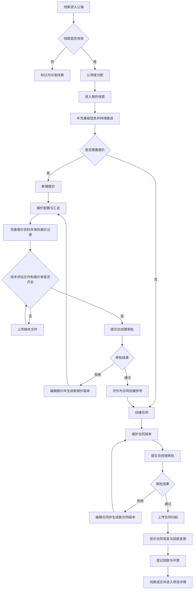
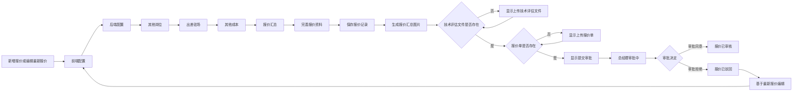
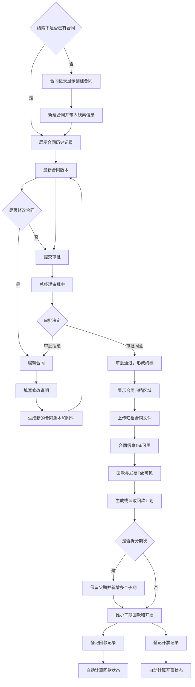
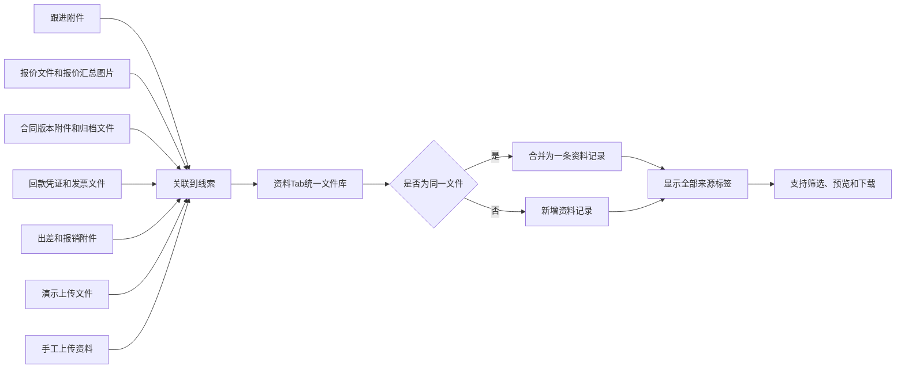
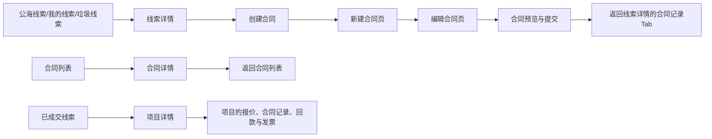

# 线索管理业务流程图

> 本文与《PRD-线索管理模块-工程开发指导》配套使用，流程图使用 Mermaid 编写，可在支持 Mermaid 的 Markdown 工具中直接渲染。

## 1. 线索主业务流程

关键规则：

- 报价是可选流程；没有审批通过报价时，仍可直接创建合同。
- 编辑报价或合同均不覆盖原记录，必须生成新版本。
- 合同审批通过前，不显示线索详情中的“合同信息”和“回款与发票”Tab。

## 2. 报价记录与审批流程

报价记录展示规则：

1. 按创建时间倒序，最新记录置顶，默认收起详情。
2. 只有最新记录可编辑或提交审批；历史记录仅查看。
3. 审批中显示“审批同意、审批拒绝”，两种操作均必须填写审批意见。
4. 报价详情展示预计周期、技术评估人、报价说明、报价汇总图片、技术评估文件、报价单和审批记录。

## 3. 合同版本、归档与回款流程

合同与回款规则：

- 一个线索仅关联一个合同，合同可有多个版本。
- 仅最新合同版本可编辑、提交审批；历史版本不显示编辑和提交审批。
- 合同审批中创建新版本时，当前审批自动撤回，新版本成为最新版本。
- 拆分后保留父期，子期以“第 N 期-1 / 第 N 期-2”层级展示；子期金额合计必须等于父期应回款金额。
- 回款、开票状态由该期明细累计金额自动计算，不允许手工改状态。

## 4. 文件归集与资料 Tab 流程

文件规则：

1. 资料 Tab 是该线索全部文件的权威入口；演示 Tab 只展示演示记录和网址。
2. 同一文件被多个业务模块引用时，资料 Tab 只展示一条，并显示多个来源标签。
3. 文件需保留来源模块、来源业务记录、上传人、上传时间，供资料列表筛选和追溯。
4. 删除文件引用时仅删除当前业务引用；没有其他引用时才删除实际文件。

## 5. 页面跳转流程

跳转规则：

- 从线索详情进入合同新建、编辑或查看流程后，返回时必须回到原线索详情及原 Tab。
- 从合同列表进入合同详情时，返回合同列表，不能跳转线索详情。
- 已成交线索的名称和详情入口均跳转项目详情。
