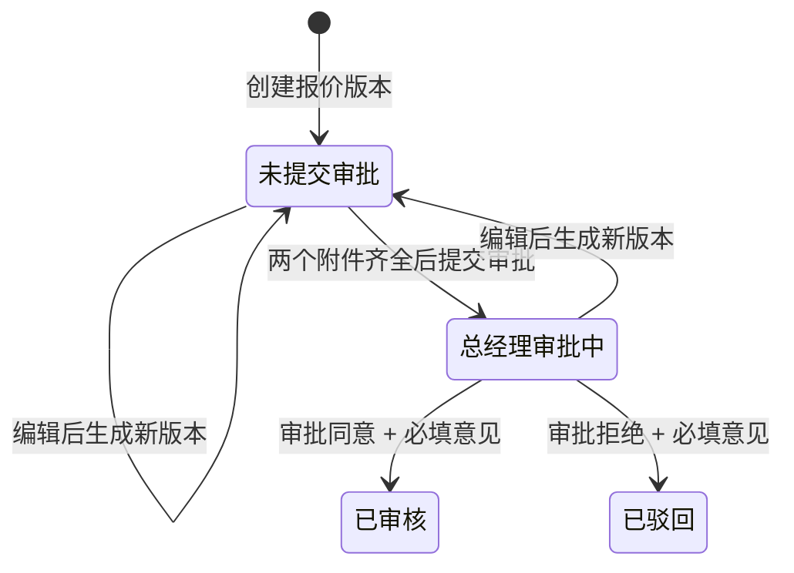

# 线索详情页“报价”Tab 开发对齐说明

| 项目 | 内容 |
| --- | --- |
| 对齐目标 | 保证线索详情、项目详情中的报价功能采用同一规则、同一计算口径和同一版本/审批行为。 |
| 适用范围 | 报价系统配置、报价资料、历史记录、附件、审批、资料归集。 |
| 非目标 | 不在本次实现多人审批流、报价记录删除、在线编辑报价单。 |

## 1. 统一实现边界

报价能力必须复用，不允许在线索详情、项目详情分别复制一套业务逻辑。

| 能力 | 统一要求 |
| --- | --- |
| 报价历史 | 两个页面使用同一报价历史组件，统一倒序、最新判断、附件展示、审批按钮判断和展开状态。 |
| 报价系统 | 两个页面使用同一报价系统配置组件、同一平台/岗位/成本选项和同一计算函数。 |
| 报价汇总 | 统一使用相同的汇总明细和报价系统记录生成逻辑。 |
| 审批 | 统一使用“总经理”单节点审批状态机。 |
| 文件 | 统一通过文件服务上传、预览、下载，并同步至线索资料索引。 |

现有前端可复用的实现入口：

- `src/app/pages/leads/components/LeadQuotationHistoryPanel.tsx`
- `src/app/pages/project-management/ProjectQuotationConfigurator.tsx`
- `src/app/pages/project-management/projectQuotationConfigModel.ts`
- `src/app/pages/project-management/QuotationSummaryReport.tsx`

## 2. 页面与服务职责

| 层级 | 职责 |
| --- | --- |
| 页面容器 | 读取线索、员工、报价记录；控制新增/编辑/审批弹窗；处理页面刷新。 |
| 报价系统组件 | 编辑报价配置，展示实时计算结果；不直接创建报价记录。 |
| 报价资料组件 | 填写报价人、金额、周期、技术评估人、说明，并展示报价汇总。 |
| 报价历史组件 | 只负责展示报价版本、附件、审批记录和触发动作。 |
| 报价服务 | 负责创建版本、保存配置快照、计算校验、审批流转、文件关联。 |
| 文件服务 | 负责上传、预览地址、下载地址、文件安全校验及线索资料索引。 |

## 3. 接口对齐建议

以下为接口职责约定，路径可按现有服务规范调整。

| 场景 | 建议接口 | 关键要求 |
| --- | --- | --- |
| 查询报价历史 | `GET /leads/{leadId}/quotations` | 服务端按创建时间倒序返回；返回最新标记、汇总、附件和审批记录。 |
| 新增报价 | `POST /leads/{leadId}/quotations` | 接收报价系统配置快照、汇总结果、报价资料；创建新报价版本。 |
| 编辑报价生成新版本 | `POST /quotations/{quotationId}/versions` | 不允许覆盖旧报价；服务端生成新报价 ID 并标记为最新。 |
| 上传技术评估文件 | `POST /quotations/{quotationId}/files` | 文件类型为 `technical_evaluation`。 |
| 上传报价单 | `POST /quotations/{quotationId}/files` | 文件类型为 `quotation_document`。 |
| 生成/关联报价系统记录 | 由创建报价接口内部完成或单独调用文件服务 | 文件名为`[系统名称]报价单YYYYMMDD+时间戳后6位.png`，返回可预览、可下载的持久化地址，不能使用浏览器临时 Blob 地址。 |
| 提交审批 | `POST /quotations/{quotationId}/approval` | 校验记录是最新版本且两个必备附件齐全。 |
| 审批决定 | `POST /quotations/{quotationId}/approval/decision` | 请求包含 `decision`、`comment`；审批意见不能为空。 |
| 文件预览/下载 | 文件服务预览、下载地址 | 前端不自行拼接文件地址。 |

接口返回必须同时满足：

1. 报价金额、汇总金额使用数值字段，前端只负责格式化展示。
2. 每次版本创建返回完整的新报价记录，避免前端自行拼装版本状态。
3. 返回附件类别，前端据此决定显示“报价系统记录”“技术评估文件”“报价单”。
4. 返回审批节点、操作人、操作时间、意见和节点状态，前端不推断审批历史。

## 4. 版本与最新记录约束

1. “最新报价”必须由服务端判定，不能仅依赖前端列表第一条。
2. 新增报价、编辑报价完成后均创建新记录；旧记录的金额、配置、附件、审批记录均不可被覆盖。
3. 只有最新报价可以执行编辑、附件补传、提交审批和审批处理。
4. 历史记录不显示“未提交审批”提示，也不显示编辑、提交审批或上传附件按钮。
5. 列表排序以版本创建时间倒序为准，创建新版本后立即置顶。
6. 报价系统的全部配置和报价汇总必须作为版本快照保存；后续修改岗位日成本、平台配置或成本字典，不能改写历史报价。

## 5. 报价计算口径

### 5.1 计算原则

1. 前端用于实时预估，服务端在创建报价时必须按相同规则复算并以服务端结果为准。
2. 人数、天数、费用均不可为负；人数和天数按整数处理，金额可保留两位小数。
3. 项目总报价为 0 时不允许进入报价资料页或创建报价版本。
4. 总人天为全部人力项的“人数 × 天数”之和；预计工期取各人力项天数的最大值。

### 5.2 公式对齐

| 项目 | 公式 |
| --- | --- |
| 人力项小计 | 人数 × 天数 × 日均成本 |
| 出差成本 | 往返交通费 + 出差住宿费 + 出差补贴 |
| 驻场成本 | 驻场住宿费 + 驻场餐饮补贴 + 驻场交通补贴 |
| 销售提成 | （人力成本 + 出差成本 + 驻场成本 + 固定其他成本）× 销售提成比例 |
| 其他成本 | 固定其他成本 + 销售提成 + 其他销售费用 |
| 项目总报价 | 人力成本 + 出差成本 + 驻场成本 + 其他成本 |

金额计算需避免浮点误差：服务端使用最小货币单位或高精度小数计算，最终按统一规则保留两位小数。

## 6. 审批状态机

开发要求：

1. 提交审批前在服务端校验：当前记录为最新、状态为未提交审批、技术评估文件和报价单均存在。
2. 审批决定前在服务端校验：当前记录为最新、存在待处理的总经理节点、审批意见非空。
3. 审批同意后状态固定为“已审核”；审批拒绝后固定为“已驳回”。
4. 审批记录中必须保存发起申请、总经理审批两个节点，供前端按时间展示。

待产品确认：当前原型允许编辑“总经理审批中”的最新报价并生成新版本。正式实现需明确旧版本待处理审批的处理方式；建议在生成新版本时自动撤回旧版本待处理审批，并在旧版本审批记录中写明撤回原因，避免同一线索同时存在两个待审批报价。

## 7. 附件与资料归集对齐

1. 报价系统记录、技术评估文件、报价单均应作为独立文件上传/生成，并关联到报价版本。
2. 文件成功后立即建立与该线索的资料关联，资料Tab可按“报价”来源检索到。
3. 同一物理文件被报价记录与资料Tab引用时只保留一份文件实体，不重复上传。
4. 删除或替换业务引用时，只解除当前引用；没有其他引用时才允许清理物理文件。
5. 文件名点击预览，下载动作使用文件服务返回的下载地址；文件类型不支持预览时提示下载查看。
6. 报价系统临时配置不上传文件；报价系统记录必须在报价版本创建成功后持久化，不能依赖浏览器内存地址。

## 8. 员工与基础数据来源

| 字段/配置 | 数据来源 | 对齐要求 |
| --- | --- | --- |
| 报价人 | 员工列表与当前登录会话 | 使用在职员工；新增报价时默认当前登录用户，支持手动修改；保存员工 ID 和展示名称。 |
| 技术评估人 | 员工列表或技术评估人员配置 | 必填、多选；若后续配置岗位范围，前端按该范围过滤；未配置时按可选员工列表展示，保存时以“、”展示。 |
| 前端平台、后端服务、标准岗位、成本项 | 报价配置字典 | 本期可使用固定字典；后续变为可配置时历史报价仍读取版本快照。 |
| 日均成本 | 报价系统默认值或用户录入 | 默认值仅用于初始化，报价版本以提交时实际值为准。 |

## 9. 前端交互对齐

1. 前端、后端服务项均以 6 列网格展示，勾选框放在卡片右侧。
2. 选择“自定义”前，不渲染自定义技术栈输入区；取消选择后不参与报价计算。
3. 报价历史初次加载、切换线索、重新请求数据后默认全部收起。
4. 最新记录可操作按钮靠左，“展开详情 / 收起详情”固定靠右。
5. 未上传的技术评估文件、报价单不展示空文件行；缺失文件以操作区上传按钮提示。
6. 审批记录只有在记录存在时才显示；已审核、已驳回不显示提交审批按钮。
7. 报价系统记录、技术评估文件、报价单在附件区域每条独占一行，名称与操作列对齐。
8. 预计周期为必填正整数，前端限制非数字及 0 输入，服务端同步校验；保存展示统一追加“天”。

## 10. 联调与测试清单

### 10.1 接口联调

- [ ] 报价历史接口始终返回正确的最新标记、倒序结果和完整审批节点。
- [ ] 创建报价后返回新的版本记录、报价汇总结果和持久化的报价系统记录地址及文件名。
- [ ] 编辑报价不会更新旧记录；重新查询后新版本置顶。
- [ ] 上传技术评估文件、报价单后，接口返回的附件状态可立即支持审批校验。
- [ ] 不满足“最新版本 + 附件齐全”的请求，服务端必须拒绝提交审批。
- [ ] 审批同意/拒绝都无法绕过审批意见必填校验。

### 10.2 计算测试

- [ ] 人力、出差、驻场、销售提成、其他销售费用、总报价分别覆盖 0、单项、多项和小数金额场景。
- [ ] 驻场 1 天、30 天、31 天的月度住宿/交通计算正确。
- [ ] 前端实时结果与服务端最终结果一致。
- [ ] 历史报价不受后续成本默认值调整影响。

### 10.3 页面验收

- [ ] 新增报价可完整走通“报价系统 → 完善报价资料 → 生成报价记录”。
- [ ] 最新报价缺少一个或两个必需文件时，按钮文案及显示数量正确。
- [ ] 报价附件、报价系统记录预览/下载入口正确，且资料Tab能追溯到对应文件。
- [ ] 线索详情和项目详情的报价Tab在列表、审批、附件和计算结果上行为一致。
