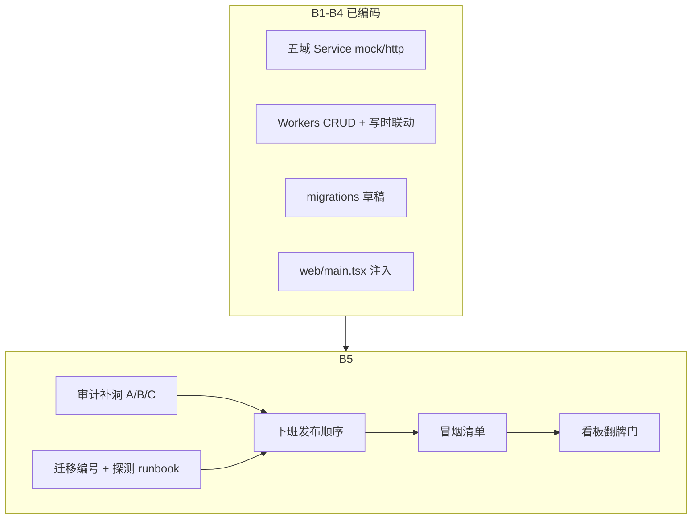
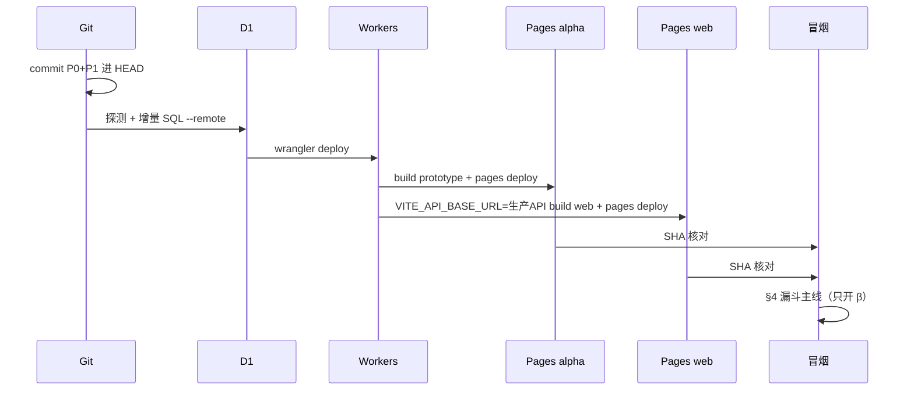

# B5 β 上线收口 · 详细设计

| 字段 | 内容 |
|---|---|
| 作者 | HubX 设计 |
| 日期 | 2026-08-22 |
| 状态 | Approved（详细设计，待编码） |
| 代码根 | `HubX/apps/web`、`HubX/apps/api`、`HubX/packages/ui` |
| 计划 | `计划/当前/beta-foundation-dev-plan.md` §6 |
| PRD | **无需新 PRD**（计划已写明；业务规则以 `文档/PRD/` 现行稿 + `HubX/CONTEXT.md` 为准） |
| 事实源 | `HubX/CONTEXT.md`；`HubX/docs/adr/0093-signing-open-linkage-moves-server-side.md`；`HubX/docs/adr/0094-beta-data-foundation-doc-store-optimistic-lock-server-trust.md`（opex 的 ADR-0093/0094 同号不同文，引用必须带完整文件名） |
| 部署 | `HubX/docs/DEPLOYMENT.md`「下班发布」 |
| 看板 | `HubX/packages/ui/src/app/version/featureBoard.config.json` |
| `productionOn` 确认 | 2026-08-22 口头；确认人=用户；目标见 §5.3；**P3 冒烟后才改 JSON** |

本文只定实现规格与上线操作。**禁止**在本设计阶段改 `HubX/packages/ui/`、`HubX/apps/` 生产代码；**禁止** `wrangler deploy` / `d1 execute --remote`。开工切片见文末 **PR Plan**。编码/操作时：测试从 `HubX/apps/prototype` 跑；Workers value import 必须相对路径，禁止 `@/`。

B5 的本质是 **核对 + 补洞 + runbook + 看板翻牌门**，不是从零接线。B0–B4 已完成编码（见计划表），工作区相对 HEAD `4fdecb1` 仍有未提交改动。

---

## Overview

β（`apps/web` + `apps/api` + D1）漏斗主线五个域的 http 注入、D1 文档表、Workers CRUD 与签约写时联动，在 B1–B4 已经落地。B5 要做的是：确认 β 路径没有悄悄退回 mock、把未执行的 D1 迁移按可重复顺序跑上生产、按「提交 → 迁移 → Workers → 双前端 → SHA → 冒烟」发布，并在 **P3（冒烟通过后）** 按 §5.3 已冻结目标翻 `beta.productionOn`（编码/发布阶段仍不得提前改 JSON）。

对照代码后的判断：`apps/web/src/main.tsx` 已注入五个 http service 并设 `__ZK_BETA__ = true`；`apps/api/migrations/` 已有四份 SQL，但两个文件都叫 `0002_*.sql`；生产 D1 是否已跑迁移**以实施当天探测为准**（交接写「未执行」，本设计未连远程核验）。真正会挡冒烟的洞有三处，**均纳入 B5、不再问用户**：

1. **洞 C（必做）**：`PUT /api/contracts/:id` 首次 INSERT 不跑联动，后续 PUT 的 `prevSnapshot` 含本 id，使 `diffContractEvents` 的 `created` 永假；`spawnUnconfirmedProject` 是死代码。
2. **洞 A（必做）**：β `SigningOpenBridge` 不刷新 `ProjectContext`。只修 A 不修 C，refresh 仍是空列表。
3. **洞 B（必做）**：合同详情 `addCollection` 只写嵌套流水，360 读 `collections` 表。

其余（SOP、商机 HTTP、回款看板、登录）明确不在 B5。

---

## Background & Motivation

### 已完成阶段（引用，不重做）

| 阶段 | 状态 | 要点 |
|---|---|---|
| B0 | 完成 | ADR-0093 签约联动服务端化；ADR-0094 D1 文档式 + 乐观锁 + actor/时钟 |
| B1 | 编码完成；D1 迁移待线上执行 | `quotes`/`contracts` 加 `version`；PUT 409；`updatedAt` 服务端；`X-Actor` |
| B2 | 编码完成 | `LeadService` mock/http；`leads` / `lead_followups` / `lead_transfers` |
| B3 | 编码完成（**spawn 路径现网不可达，见洞 C**） | Workers 合同 PUT **意图**在 `handleSigningLinkage` 内 `spawnUnconfirmedProject` / `startDelivery` / `shelveProject`；前端桥 α 仍 diff、β 跳过业务。现网 `if (old)` + `prevSnapshot = { [id]: oldDoc }` 使 `events.created` 永假 |
| B4 | 编码完成 | `ProjectService` + `CollectionService`；期次仍在合同 `paymentPlans`；实收独立 `collections` 表 |

B4 已知未做（交接 2026-08-22）：回款看板 P1–P5；合同详情 `addCollection` 未双写 `collections`；D1 四份迁移未上生产；`productionOn` 未代开。

### 现网核对（编码前，2026-08-22 读仓库）

| 点 | 现网 | 结论 |
|---|---|---|
| β 入口 | `HubX/apps/web/src/main.tsx` 注入 `createHttpQuotationService` / `createHttpContractService` / `createHttpLeadService` / `createHttpProjectService` / `createHttpCollectionService`，`actor = CURRENT_LOGIN_USER.name`，`(globalThis).__ZK_BETA__ = true` | **已接五域 http，不必再接线** |
| α 入口 | `HubX/apps/prototype/src/main.tsx` 只 `<App />`，不传 service | α 继续 mock，正确 |
| App 壳 | `App.tsx` 把五个 service 传入对应 Provider；缺省 mock | β 只要入口注入就不走 mock |
| 报价/合同/线索/项目/实收 Context | `service ?? createMock*Service()`；`useEffect` 调 `svc.list()` | β 注入后列表走 http。**无导航级 refetch**（见洞 A） |
| 项目首帧 | `ProjectProvider`：有 `service` 时 `useState([])` + `loading=true`；无 service 时 `initialProjects` | α SSR 单测不破；β 首帧空列表直到 GET 返回 |
| 真正项目列表 | `/projects` → `ProjectList.tsx`（不是 `Projects.tsx`） | 已切 `useProjects()`；展示层仍 overlay `PROJECT_LIST` |
| 签约桥 | `ApprovalDeliveryBridge.tsx` 文件头写「合同列表变化时刷新项目」，`isBeta()` 为 true 时 **直接 `return`，且未从 `useProjects()` 取出 `refresh`** | **洞 A**：同会话列表不更新。注释与实现不一致，P0 一并改注释 |
| 合同 PUT 联动 | `apps/api/src/index.ts`：仅 `if (old)` 才 `handleSigningLinkage`；`prevSnapshot` 固定 `{ [id]: oldDoc }` | **洞 C**：首次向导 PUT 是 INSERT（`old` 空）整段跳过；之后 `existedInPrev` 恒 true，`created` 永不命中。批准路径 ADR-0067 无项目则 `continue`，**从不 INSERT projects**。另：`buildUnconfirmedProject` 读 `contract.customerName`（字段在 `current`） |
| SOP | α 桥内 `generateDeliveryPlan` + `saveDeliveryPlan`（模块内存 `deliveryPlanStore.ts`）。Workers `handleSigningLinkage` **不写 SOP**，`schema.sql` **无** `delivery_plans` 表 | B3 原文「生成 SOP」未做完。B5 **不补**（交付支撑，计划 §7） |
| 商机 | `BusinessCaseContext` 纯内存 `initialBusinessCases`；Workers 有 `/api/cases` 但前端未注入 | B5 **不接**商机 HTTP |
| 合同登记实收 | `ContractDetail.handleRegisterMainPayment` → `useContracts().addCollection` → `applyAddCollection` 写 `collectionRecords` + `receivedAmount` | **洞 B**：不写 `collections` 表 / `CollectionContext` |
| 360 实收 | `ProjectDetail360` 只读 `useCollections()` + `collectionsForProject`；**无登记按钮** | 用户登记入口只在合同详情 |
| 360 金额首帧 | `seedMetrics = PROJECT_LIST.find`；`receivedAmount` 在实收合计为 0 时回退 `mainContract.receivedAmount` 或种子 | 种子项目可能闪一下 mock 口径；B3 spawn 的 `ap-*` 不在 `PROJECT_LIST`，走 `deriveProjectViewMetrics` |
| 补充协议回款 | `ContractDetail` 页面 `useState`，不进 Context / D1 | 对象将废弃；B5 不收 |
| 回款看板 | `PaymentKanbanV2` / `paymentCalc` 仍读 `contract.collectionRecords` | **不在 B5**（`payment-kanban-dev-plan.md` P1–P5） |
| D1 schema | `HubX/apps/api/schema.sql` 已含 quotes/contracts/leads/followups/transfers/projects/cases/collections，均有 `version` | 全新库用这一份即可 |
| 迁移 | `0001_add_version.sql`（ALTER 非幂等）；`0002_add_leads.sql`；`0002_add_projects_cases.sql`（**编号冲突**）；`0003_add_collections.sql`。`wrangler.toml` **无** `migrations_dir` | 现流程是 `d1 execute --file` 手工跑 |
| Workers 路由 | `/api/quotes` `/api/contracts` `/api/leads*` `/api/projects` `/api/collections` `/api/cases`；合同 PUT 后 `handleSigningLinkage` | 与五域 http 对齐；`GET /api/quotes` 会 `ensureSeed` 插入 `q-seed-1` |
| 线上 | α `https://alpha.zkhubx.com`；β `https://beta.zkhubx.com`；API `https://zkhubx-api.llhfire.workers.dev`；D1 `zkhubx-db` id `ac02e216-2523-4a84-aa3e-f1eedbd53339` | 交接：四份迁移待远程执行 |
| 看板 | 见 **§5**。`productionOn`：仅「线索全流程」为 true；报价/合同已上 http 但开关仍 false。planned 出现非法值 `编码中` / `β 已实现`（`PLANNED_STATUSES` 不含二者，PUT `/api/feature-board` 会 400） | 翻牌必须先扩枚举，且 **productionOn 禁止 agent 代开** |

### 痛点

1. 代码以为「Workers 已 spawn」，β 实际从未 INSERT `projects`；只 refresh 仍是空列表。合同页登记的实收 360 看不到。
2. 生产 D1 可能仍是旧 quotes/contracts 形（以探测为准），新 Workers 一发就会打不存在的表/列。
3. 两个 `0002_*.sql` 让执行顺序靠口述，容易漏表；0001 两条 ALTER 不能整文件跳过。
4. 看板 `productionOn` / `devStatus` 与真实上线分叉；agent 若按字面把开关翻开，违反 `HubX/CLAUDE.md` §功能看板第 3 条。

---

## Goals & Non-Goals

### Goals

1. **审计落地**：β 漏斗五域（报价 / 合同 / 线索 / 项目 / 回款实收）确认走 http；把会让主线冒烟失败的洞 **A / B / C 全部补上**（均必做，不再作为 Open Question）。
2. **D1 对齐**：迁移文件编号唯一、与 `schema.sql` 同构；给出探测 + 按序执行 + 核对清单。本设计阶段只写规格，**不执行** `--remote`。
3. **可执行 runbook**：提交 → D1 → Workers → α/β Pages → `wrangler pages deployment list` Source SHA = HEAD → 冒烟。
4. **冒烟用例**：β 独立完成 线索 → 报价 → **向导创建主合同草稿即出现未确认项目** → 确认指派 → 合同批准（已指派则开工）→ 实收登记；**不依赖任何 α 页面开着**。不要用「批准才立项」当验收（ADR-0095）。洽谈、尚无合同的 spawn 归 U1，不在 B5。
5. **看板翻牌矩阵**：每个相关模块改哪些字段；`productionOn` 目标已口头冻结（§5.3），**仅 P3 且冒烟通过后**按该表改 JSON，此前禁止动开关。

### Non-Goals（计划 §7 与 B4 边界，禁止重开）

- 回款看板 / 甘特图 UI（`计划/当前/payment-kanban-dev-plan.md` P1–P5；口径见 `conflict-spawn-and-collections.md`）。
- U1 线索洽谈（无合同）spawn（ADR-0095；B5 只保证合同创建 spawn）。
- 登录认证 / 权限拦截 / 操作日志（「基础工具」planned 仍「未开始」）。
- 日报 / 差旅 / 运营费用 / 精益交付 的 β 接缝。
- D1 关系建模拆列、WebSocket、合并冲突 UI（ADR-0094）。
- 商机 `BusinessCase` HTTP 化、SOP/`delivery_plans` 持久化、补充协议回款进 D1。
- 新 PRD、改漏斗业务规则、改 `caseUtils` 语义。
- 本设计阶段改功能看板 JSON / 架构图 / 生产代码 / 真实部署。
- 把 `CURRENT_LOGIN_USER` 换成真实会话（仍 `X-Actor: 张三`，`isAdmin: true`）。

---

## Proposed Design

### 0. B5 工作性质



工程师按 PR Plan 分步：**P0（洞 A+B+C）与 P1（迁移改名 + DEPLOYMENT）可分开审查合入，但第一次生产发布必须同一次下班**：P0+P1 已进 HEAD → 探测/迁移 → Workers → 双前端 → SHA。冒烟通过后 **P3 按 §5.3 已确认目标翻牌**（不得提前改 `productionOn`）。禁止「只发 P0 前端」或「先发 Workers 后迁 D1」。

### 1. β 注入与 mock 泄漏审计

#### 1.1 允许的 mock（不是泄漏）

| 用法 | 文件 | 为何允许 |
|---|---|---|
| Provider 缺省 `createMock*Service()` | 五个 Context | α / 单测入口不传 service |
| `initialProjects` 首帧 | `ProjectContext.tsx` | 仅 `service` 为空 |
| `PROJECT_LIST` overlay 展示字段 | `ProjectList.tsx`、`ProjectDetail360.tsx` | 只补客户名/健康度等；写入走 Context。B3 spawn id=`ap-{contractId}` 走 `deriveProjectViewMetrics` |
| 日报/任务/会议/确认书/演示 | `project-management/mockData`、`projectMockData` | 计划 §7，未接缝 |
| 运营费用/差旅/精益/线索成本 | 各模块 mock | 同上 |
| α 签约桥 diff | `ApprovalDeliveryBridge.tsx` | `__ZK_BETA__` 未设 |

#### 1.2 写入路径必须走 http（β）

核对清单（发布后用 DevTools Network，host = `VITE_API_BASE_URL` 或默认 `http://localhost:8787`）：

| 用户动作 | 前端 | 请求 |
|---|---|---|
| 线索五池加载 | `LeadsProvider` `svc.list()` | `GET /api/leads` |
| 新建线索 | `createLead` | `POST /api/leads` |
| 领取/退回/跟进 | `claimLead` / `returnLead` / `addFollowUp` | `PUT /api/leads/:id`；跟进另 `POST /api/leads/:id/followups` |
| 报价列表/创建/流转 | `QuotationProvider` | `GET/PUT /api/quotes`（创建也是 PUT upsert） |
| 合同向导/审批 | `ContractsProvider` | `GET/PUT /api/contracts` |
| 项目列表/确认指派 | `ProjectProvider` `confirmAssign` | `GET/PUT /api/projects/:id`（服务端 `validateProjectStatusWrite`） |
| 实收登记（洞 B 修复后） | `CollectionProvider.add` | `POST /api/collections` |

禁止：β 下这些动作只改内存 mock、或 `fetch` 打到 Pages 自己。

#### 1.3 洞 C（必做）— Workers 首次 PUT 也要跑 `created` 联动

**现象**（`HubX/apps/api/src/index.ts` 合同 PUT）：

1. `createFromWizard` → `saveOne` 是对空行的 INSERT。`old` 为空时整段 `handleSigningLinkage` 跳过。
2. 后续 PUT 构造 `prevSnapshot = { [id]: oldDoc }`，`diffContractEvents` 里 `existedInPrev` 恒 true。`created` 定义为「快照中不存在且非作废且非同帧批准」，**永远不会命中**。
3. `events.approved` 若库中无项目则 `continue`（ADR-0067：批准时不兜底 spawn）。

因此 β 下 `spawnUnconfirmedProject` 是死代码。α 仍靠前端桥 `addProject`，所以 α 冒烟看不出这个问题。洞 A 的 `refresh()` 只是再 `GET /api/projects`，修 C 之前列表仍空。

`startDelivery` 只接受「未开始/搁置」：批准时项目若是「未确认」会 no-op。这与冒烟第 6 步期望「未确认」一致，**不是**本 bug。

**规格**：

把 prev 构造抽到 `signingOpenEvents.ts`（Workers 相对路径导入，禁止 `@/`）：

```ts
/** 服务端写时联动用。禁止传 null：null 是前端「首帧不触发」。首次 INSERT 必须传 {} 才能进 created。 */
export function prevSnapshotForWrite(
  id: string,
  old: ContractSnapshotEntry | null,
): Record<string, ContractSnapshotEntry> {
  if (!old) return {};
  return { [id]: { approvedAt: old.approvedAt, status: old.status } };
}
```

`index.ts` 在 `INSERT OR REPLACE` **之后**（无论 `old` 有无）一律 diff + 联动。D1 **没有**跨语句事务：合同行可能已落库、随后 spawn 抛错。此时客户端再 PUT 时 `old` 已在、`created` 为空、批准路径仍不兜底 → **该合同永远无 `ap-*`**。

**采用方案 ③（必做）**：每次 PUT 在事件联动之后再跑一次补洞。不依赖用户重新走向导。

```ts
const oldDoc = old ? (JSON.parse(old.data) as ContractSnapshotEntry) : null;
const prevSnapshot = prevSnapshotForWrite(id, oldDoc);
const nextContract = { id, ...data };
const events = diffContractEvents(prevSnapshot, [nextContract as Contract]);
if (events.created.length || events.approved.length || events.voided.length) {
  await handleSigningLinkage(c.env.DB, events, serverUpdatedAt);
}
// ③：草稿/未批准且非作废，该 lead 还没有项目 → 再 spawn（INSERT OR IGNORE，幂等）
await ensureUnconfirmedProjectIfMissing(c.env.DB, nextContract, serverUpdatedAt);
```

谓词抽到 `signingOpenEvents.ts`（Workers 相对路径导入）：

```ts
export function shouldEnsureUnconfirmedProject(
  next: { approvedAt?: string; status?: string; leadId?: string },
  hasProjectForLead: boolean,
): boolean {
  if (hasProjectForLead || !next.leadId) return false;
  if (next.approvedAt || next.status === 'voided') return false;
  return true;
}
```

`ensureUnconfirmedProjectIfMissing`：`SELECT` 该 `leadId` 是否已有项目，谓词为 true 则走与 `events.created` 相同的 spawn 写入。批准路径 **仍不**因此兜底 spawn（ADR-0067：已有 `approvedAt` → 谓词 false）。

否决 ①（合同与 projects/cases 同一 `db.batch`）：批准/作废必须先 SELECT 再 UPDATE，整段 PUT 无法无读地塞进一个 batch；只 batch created 仍挡不住「合同已写入、spawn 随后失败」的重试窗。否决 ②（500 + 口述删行）：依赖手工 D1，冒烟第 4 步会卡住。

- 向导首次 PUT 是草稿、无 `approvedAt`：`created` 与 ③ 都会 spawn，后者在前者失败后的**下一次保存草稿 PUT**补上。
- 幂等：`handleSigningLinkage` / ③ 均按 `leadId` 查现有项目，`INSERT OR IGNORE`。
- **展示字段**：`buildUnconfirmedProject` 的客户名/主体从 `current` 读，回退顶层：

```ts
const cur = (contract.current && typeof contract.current === 'object')
  ? (contract.current as { customerName?: string; signingEntity?: string })
  : {};
const customerName = cur.customerName ?? (contract.customerName as string | undefined);
const signingEntity = cur.signingEntity ?? (contract.signingEntity as string | undefined);
```

`lead: { id: leadId, name: customerName }`；`contract: { id, current: { customerName, signingEntity } }`。

验收：本地 `wrangler dev` 或 D1：首次 PUT 草稿后 `SELECT id FROM projects;` 出现 `ap-{合同id}`。再测：先只写入合同行、不插 projects，第二次 PUT 同一草稿 → ③ 补出项目。单测见 §6。

#### 1.4 洞 A（必做）— β 桥刷新项目

**现象**：即使洞 C 已写入 D1，`ProjectProvider` 只在 `svc` 引用变化时 `list()` 一次。β 分支注释「下次导航时自然刷新」为假：`refresh` 不随路由调用，且当前代码**没有**从 `useProjects()` 取出 `refresh`。

**规格**（`ApprovalDeliveryBridge.tsx`）：

- 文件头改为与实现一致：「β：合同列表变化且有 created/approved/voided 时 `refresh()` 项目 Context；不承担 spawn。」
- α 分支保持现有 `addProject` / `startDelivery` / `saveDeliveryPlan`（仍可不处理 `voided`）。β **禁止** `addProject`。
- **快照形状（必改）**：现网 `snapshotRef` 是 `Record<id, approvedAt 字符串>`，`diffContractEvents` 读 `prevEntry.status` / `prevEntry.approvedAt` 时 `prevEntry` 是 string，`voided` 恒空。P0 改为与服务端 `prevSnapshotForWrite` 同形：

```ts
const snapshotRef = useRef<Record<string, ContractSnapshotEntry> | null>(null);
// 构建下一份快照
const next: Record<string, ContractSnapshotEntry> = {};
contracts.forEach((c) => {
  next[c.id] = { approvedAt: c.approvedAt, status: c.status };
});
```

```ts
const { getProjectByLeadId, updateProject, addProject, refresh } = useProjects();
// ...
const events = diffContractEvents(prev, contracts);
if (isBeta()) {
  if (events.created.length || events.approved.length || events.voided.length) {
    void refresh().catch(() => {
      Message.warning('项目列表同步失败，请刷新页面');
    });
  }
  return;
}
```

- 不接 `BusinessCaseContext` HTTP。
- 前端桥 `prev === null` 仍不触发（与 `diffContractEvents(null)` 首帧语义一致；**不要**和服务端 `prevSnapshotForWrite` 的 `{}` 搞混）。

验收：洞 C 修好后，β 向导创建合同（不必等到批准）同会话打开 `/projects`，**不整页 F5** 即见 `ap-{contractId}`、状态「未确认」。

#### 1.5 洞 B（必做）— 合同登记双写实收台账

**现象**：

- 写：`ContractsContext.addCollection` → `applyAddCollection` → 合同 JSON `collectionRecords` + `receivedAmount`。
- 读（360）：`CollectionContext` ← `GET /api/collections`。360 **无**登记按钮。
- 现网 http **不抛错**：`saveOne` 409 → `Message.warning` + `return false`；`mutate` 忽略返回值；`createHttpCollectionService.add` 非 2xx → `Message.error` + `return ''`。页面 `.then()` 仍会成功 toast。
- `applyAddCollection` 用 `col-${Date.now()}`，台账再生成另一个 id。
- `contract.projectId` 在 spawn 后**不会**回写合同 JSON，冒烟新合同常为 `undefined`。360 靠 `collectionsForProject` 的 `contractIds` 仍能看见，但 payload 应写全。

CONTEXT：实收独立台账；_Avoid_「用合同嵌套流水替代独立实收台账」。`CollectionProvider` 是 `ContractsProvider` 子级，双写必须在页面（或抽纯编排函数给页面调用）。

**钉死顺序：先合同 PUT，成功后再 POST 台账。** 禁止先台账。不迁源、不删 `collectionRecords`、不做 Workers 对嵌套流水的 diff。

**接口**：

`ContractService.addCollection` 改为：

```ts
addCollection(
  contractId: string,
  record: Omit<CollectionRecord, 'id' | 'contractId'> & { id?: string },
): Promise<boolean>;
```

http = `saveOne` 结果；mock 恒 `true`。参数必须允许 `id?: string`，与 `applyAddCollection` / 编排传入的 `withId` 对齐。

`ContractsContext.addCollection` 同签名、返回 boolean。**无论 true/false 都 `await refresh()`**（409 后必须拉到新 `version`，否则下一次 PUT 仍撞锁）。`mutate` 对这条路径必须把 `saveOne` 的 `false` 传出（不要只 `await saveOne` 丢弃）。建议抽 `mutateReturningOk`，避免改掉其它仍返回 `void` 的动作。

`applyAddCollection` 允许调用方带 `id`：

```ts
export function applyAddCollection(
  c: Contract,
  record: Omit<CollectionRecord, 'id' | 'contractId'> & { id?: string },
  contractId: string,
): Contract {
  const id = record.id ?? generateCollectionId();
  const records = [...(c.collectionRecords ?? []), { ...record, id, contractId }];
  return { ...c, collectionRecords: records, receivedAmount: records.reduce((s, r) => s + r.amount, 0) };
}
```

**编排**（抽 `registerMainPaymentDualWrite`，供页面与单测）：

```ts
export type DualWriteStatus = 'ok' | 'contract-failed' | 'ledger-failed';

export async function registerMainPaymentDualWrite(input: {
  contractId: string;
  projectId?: string;
  record: Omit<CollectionRecord, 'id' | 'contractId'>;
  addToContract: (contractId: string, record: Omit<CollectionRecord, 'id' | 'contractId'> & { id?: string }) => Promise<boolean>;
  addToLedger: (entry: Omit<CollectionLedgerEntry, 'id'> & { id?: string }) => Promise<string>;
}): Promise<{ status: DualWriteStatus; collectionId: string }> {
  const id = generateCollectionId();
  const projectId = input.projectId || `ap-${input.contractId}`;
  const withId = { ...input.record, id };
  const contractOk = await input.addToContract(input.contractId, withId);
  if (!contractOk) return { status: 'contract-failed', collectionId: id }; // 禁止 addToLedger
  const ledgerId = await input.addToLedger({
    ...withId,
    contractId: input.contractId,
    projectId,
  });
  if (!ledgerId) return { status: 'ledger-failed', collectionId: id };
  return { status: 'ok', collectionId: id };
}
```

页面：`projectId` 取 `contract.projectId ?? getProjectByLeadId(contract.leadId)?.id ?? ('ap-' + contract.id)`。用 state 保存最近一次 `collectionId`。

| 结果 | UI |
|---|---|
| `ok` | `Message.success('回款登记成功，已更新合同回款数据')`；关弹窗；清 `ledgerRetryId` |
| `contract-failed` | 不再二次 toast（http 已 warning 409）；**不**关弹窗；主提交保持可用 |
| `ledger-failed` | `Message.error('合同已记回款，实收台账未写入，请重试台账')`；**禁用主提交（确定）**，只启用「重试台账」；按钮只调 `addToLedger({ ...payload, id: collectionId, contractId, projectId })`，禁止再走 `registerMainPaymentDualWrite`（否则新 id 再 PUT 合同会叠一笔嵌套流水） |

`INSERT OR IGNORE` 使同一 `collectionId` 的台账重试安全。

α mock 合同与台账分内存，同一编排后 360 与合同页一致。补充协议弹窗仍页面局部，不双写。

#### 1.6 明确不补的缝（审计看见但不做）

| 缝 | 处理 |
|---|---|
| Workers 无 SOP / 无 `delivery_plans` | 冒烟不要求交付计划页自动出现 SOP。P3 项目管理 note 写死：「SOP 仍 α 内存，β 批准不自动落交付计划」 |
| `/api/cases` 前端未用 | 列表/360/确认指派不依赖商机 Context |
| `PROJECT_LIST` 首帧口径 | spawn 项目不命中种子；不改 overlay |
| `GET /api/quotes` `ensureSeed` | **接受**生产出现 `q-seed-1` / `QT-2026-1`（B1 起 `INSERT OR IGNORE`）。冒烟用新建数据，不要改/删这条 |
| `createHttpLeadService.getDetailInfo` | 已拉取线索仍 `seedFallback` → `getLeadDetailInfo`（模块种子）。新线索无种子时 360 档案可能空。B5 **不补**明细 HTTP。冒烟第 2 步用列表字段 + 工作台/向导，**不把线索 360 档案当断言** |
| 日报/任务 mock | 360 这些 Tab 继续空或种子，不挡漏斗 |

### 2. D1 迁移编号与 schema 对齐

#### 2.1 目标终态（与 `schema.sql` 一致）

| 表 | 列 |
|---|---|
| `quotes` `contracts` `leads` `projects` `cases` `collections` | `id TEXT PK`，`data TEXT NOT NULL`，`updated_at TEXT`，`version INTEGER NOT NULL DEFAULT 0` |
| `lead_followups` `lead_transfers` | `id TEXT PK`，`lead_id TEXT NOT NULL`，`data TEXT NOT NULL`，`updated_at TEXT`（无 version） |

全新库：只执行 `schema.sql`，**不要**再跑 0001（`ALTER TABLE ... ADD COLUMN version` 在列已存在时失败）。

已有库（生产现状：历史上用旧 schema 初始化过 quotes/contracts）：按序跑增量。

#### 2.2 重编号与注释 cwd

交接写线上尚未跑这些文件，**未连远程核验**。实施当天**先探测再决定是否改名**：若远程已按旧文件名执行过，runbook 只按「表/列是否存在」跳过，不按「文件名是否跑过」。

仓库侧仍 `git mv` 方便口述：

| 现文件 | 改为 | 内容 |
|---|---|---|
| `0001_add_version.sql` | 保持 | 两条裸 `ALTER TABLE quotes/contracts ADD COLUMN version`（**非幂等**；`--file` 遇 duplicate 会停在第一条，第二条不跑） |
| **新增** `0001b_add_contracts_version.sql` | 新增 | **仅** `ALTER TABLE contracts ADD COLUMN version INTEGER NOT NULL DEFAULT 0;` |
| `0002_add_leads.sql` | 保持 | `CREATE TABLE IF NOT EXISTS` leads + 两个子表（幂等） |
| `0002_add_projects_cases.sql` | **`0003_add_projects_cases.sql`** | `CREATE TABLE IF NOT EXISTS` projects/cases（幂等） |
| `0003_add_collections.sql` | **`0004_add_collections.sql`** | `CREATE TABLE IF NOT EXISTS` collections（幂等） |

所有迁移文件头执行命令统一为（cwd = `HubX/apps/api`）：

```bash
npx wrangler d1 execute zkhubx-db --file migrations/<文件>.sql --remote
```

禁止再写 `apps/api/migrations/...` 这种从仓库根才成立的路径。`CREATE TABLE IF NOT EXISTS` 正文不动。

**不要**配置 `wrangler.toml` `migrations_dir` / `wrangler d1 migrations apply`。

#### 2.3 探测 SQL（执行前必跑；quotes 与 contracts **分列**）

```bash
cd HubX/apps/api
npx wrangler d1 execute zkhubx-db --remote --command \
  "SELECT name FROM sqlite_master WHERE type='table' ORDER BY name;"
npx wrangler d1 execute zkhubx-db --remote --command \
  "PRAGMA table_info(quotes);"
npx wrangler d1 execute zkhubx-db --remote --command \
  "PRAGMA table_info(contracts);"
```

判定（**禁止**「quotes 已有 version → 跳过整个 0001」）：

| 探测 | 动作 |
|---|---|
| quotes **无** version 且 contracts **无** version | `--file migrations/0001_add_version.sql` |
| quotes **有** version 且 contracts **无** | **禁止跑 0001 整文件**。`--file migrations/0001b_add_contracts_version.sql` 或 `--command "ALTER TABLE contracts ADD COLUMN version INTEGER NOT NULL DEFAULT 0;"` |
| quotes **无** version 且 contracts **有** | 不要跑 0001 整文件。`--command "ALTER TABLE quotes ADD COLUMN version INTEGER NOT NULL DEFAULT 0;"` |
| 两表都有 version | 跳过 0001 与 0001b |
| 无 `leads` | 执行 0002 |
| 无 `projects` / `cases` | 执行 0003（新文件名）；若远程已用旧 `0002_add_projects_cases.sql` 建过表，CREATE IF NOT EXISTS 无害 |
| 无 `collections` | 执行 0004 |
| 表已存在 | 对应 CREATE IF NOT EXISTS 可再执行，无害 |

`duplicate column name: version` **不得**解释成「两张表都好了」。`--file` 失败后必须再 `PRAGMA table_info(contracts)`：缺列则用 `--command` / 0001b 补第二条。

#### 2.4 执行顺序（仅实施阶段，本设计不跑）

```bash
cd HubX/apps/api
# 先按 §2.3 探测；下列为「两表都缺 version、且缺 leads/projects/collections」的完整路径
npx wrangler d1 execute zkhubx-db --file migrations/0001_add_version.sql --remote
npx wrangler d1 execute zkhubx-db --file migrations/0002_add_leads.sql --remote
npx wrangler d1 execute zkhubx-db --file migrations/0003_add_projects_cases.sql --remote
npx wrangler d1 execute zkhubx-db --file migrations/0004_add_collections.sql --remote
```

本地联调去掉 `--remote`。本地若用 `schema.sql` 建库：只确认表清单，不跑 0001/0001b。

#### 2.5 执行后核对

```bash
npx wrangler d1 execute zkhubx-db --remote --command \
  "SELECT name FROM sqlite_master WHERE type='table' ORDER BY name;"
```

期望包含：`quotes` `contracts` `leads` `lead_followups` `lead_transfers` `projects` `cases` `collections`（可另有 sqlite 内部表）。

```bash
npx wrangler d1 execute zkhubx-db --remote --command \
  "SELECT COUNT(*) AS n FROM quotes;"
# GET https://zkhubx-api.llhfire.workers.dev/api/quotes 应 200
# GET .../api/leads /api/projects /api/collections /api/contracts 应 200，空列表合法
```

`GET /api/quotes` 可能插入 `q-seed-1`（`ensureSeed`）。不要删用户数据。

同步改 `HubX/docs/DEPLOYMENT.md`「下班发布」D1 段：分列探测 quotes/contracts、0001b、cwd=`HubX/apps/api`、新文件名、**Workers 之前必须迁完**、禁止把 duplicate column 当成两表都好。

### 3. 上线 runbook

工作区相对 `4fdecb1` 有 B1–B4 + 文档未提交。**第一次生产发布必须同一次下班**：P0（洞 A/B/C，含 `apps/api/src/index.ts`）+ P1（迁移改名 + DEPLOYMENT）已进 HEAD → 探测/迁移 → Workers → α+β 前端 → SHA。禁止只发 P0 前端、禁止先发 Workers 后迁 D1。下面顺序不可颠倒。



#### 3.1 提交

在仓库根：

```bash
git status
git add -A   # 按下班仪式：有代码才提交；交接文档一并
git commit -m "..."
git rev-parse HEAD            # 记为 EXPECTED_SHA（完整）
git rev-parse --short HEAD
```

无 Cloudflare Git 集成，`git push` 不替代 Pages/Workers 上传。仍按现网仪式 push（若远程存在）。

#### 3.2 D1（Workers 之前）

见 §2.3–2.5。漏迁再发 Workers → 新路由 500。

#### 3.3 Workers

```bash
cd HubX/apps/api
npx wrangler deploy
```

验收：`https://zkhubx-api.llhfire.workers.dev/` → `{ ok: true, service: "zkhubx-api" }`。

打包注意：`index.ts` 已用相对路径导入 `signingOpenEvents` / `caseUtils` / `projectMutations` / `collectionMutations`。新增 import **禁止** `@/`。

#### 3.4 前端（α 必发，β 必发）

在 `HubX/`：

```bash
npm run build -w apps/prototype
npx wrangler pages deploy apps/prototype/dist --project-name zkhubx-alpha

VITE_API_BASE_URL=https://zkhubx-api.llhfire.workers.dev npm run build -w apps/web
npx wrangler pages deploy apps/web/dist --project-name zkhubx-web
```

`packages/ui` 是共享源，只发一个前端不够。

#### 3.5 SHA 核对

```bash
npx wrangler pages deployment list --project-name zkhubx-alpha
npx wrangler pages deployment list --project-name zkhubx-web
```

生产：`https://alpha.zkhubx.com` / `https://beta.zkhubx.com`。把 `git rev-parse HEAD` 与两次 `deployment list` 的 Source SHA **并排贴进交接**。无 Git 集成时 Pages 的 SHA 可能是上传内容哈希而非仓库 HEAD：以本次 `pages deploy` 输出的 Deployment ID 与 list 最新一条对齐，并在交接注明「仓库 HEAD = … / alpha deployment = … / web deployment = …」。对不上就先不要冒烟，重发。

#### 3.6 回滚

| 失败点 | 动作 |
|---|---|
| D1 0001 第一条 duplicate | **再 PRAGMA contracts**；缺列用 0001b / `--command`，禁止当两表都好 |
| D1 其它 SQL 失败 | 不要 deploy Workers；修脚本后重跑幂等 CREATE |
| Workers 500 | **主路径**：Cloudflare 控制台对该 Worker 回上一 version，或本机重 `wrangler deploy` 上一 commit。`wrangler rollback` CLI **未在本账号验证**，当可选 |
| 前端坏 | 对同一 project 再 deploy 上一 `dist`；或 Pages 控制台回上一 deployment |
| 冒烟失败但 API 正常 | 不要改 D1 数据「救」；按洞 A/B/C 修代码，再走同一次下班顺序重发 |

D1 `CREATE TABLE` 没有自动 down。不写 DROP 回滚。

### 4. 冒烟清单（只开 β）

环境：`https://beta.zkhubx.com`，**关掉 α 标签页**。账号仍是页面内 `CURRENT_LOGIN_USER`（张三 / 管理员），无登录页。

预检：

1. `GET https://zkhubx-api.llhfire.workers.dev/` 200。
2. DevTools：列表请求打到 `zkhubx-api.llhfire.workers.dev`，不是 mock。
3. 确认 `__ZK_BETA__`：控制台 `globalThis.__ZK_BETA__ === true`。

主线（每步看 Network）：

| # | 步骤 | 期望 | 请求 |
|---|---|---|---|
| 1 | 线索：公海新建一条，领取到「我的」 | 列表出现；刷新仍在 | `POST /api/leads`，`PUT /api/leads/:id` |
| 2 | 从线索列表/详情进工作台新建报价（**不断言** 360 档案种子客户名，见 §1.6） | 报价列表有新单 | `PUT /api/quotes/:id` |
| 3 | 报价推进到已确认（可用角色切换器；以能点「生成主合同」为准，不在本冒烟验收报价 PRD 全状态机） | 状态 `confirmed` | 多次 `PUT /api/quotes/:id` |
| 4 | 生成主合同 → 向导确认创建 | 合同看板有草稿 | `PUT /api/contracts/:id` |
| 5 | 合同审批通过（总经理节点） | 合同 `approvedAt` 有值 | `PUT /api/contracts/:id`；响应后 **同会话** 打开 `/projects` |
| 6 | 项目列表（创建草稿后即可看；批准后仍应为未确认） | 出现未确认项目，id 形如 `ap-{合同id}`，名称带客户名（洞 C 读 `current`），**不要 F5** 也能看见（洞 A） | 向导 PUT 即应 `INSERT projects`；桥 `GET /api/projects` |
| 7a | **UI**：管理员确认指派产品经理 | 状态「未开始」，有负责人 | `PUT /api/projects/:id` body 含 owner |
| 7b | **可选 API 负例**（curl，非页面） | 未确认直接改进行中 → 400 | `validateProjectStatusWrite` |
| 8 | 合同详情登记一笔实收 | 合同页已回款增加；Network 先合同 PUT 再 `POST /api/collections`，**同一 id** | 409 时不得出现 POST collections |
| 9 | 项目 360「回款与发票」 | **实收台账有这一笔**；标的额来自合同不是 `PROJECT_LIST` | `GET /api/collections` |

失败判定：

- 第 6 步 D1 无 `ap-*` 行 → 洞 C 未做完。有行但必须 F5 才出现 → 洞 A 未做完。
- 第 9 步空、合同页有数 → 洞 B 未做完（或 409 后仍 POST / 未共用 id）。
- **第二浏览器**（第 4 步向导创建后，不依赖本机 SPA）：只开 `/projects` 也应看到项目。此断言 **仅在洞 C 修好后成立**。桥只负责当前页 refresh。

回归（短）：α `https://alpha.zkhubx.com` 仍 mock、无 API 请求；批准合同仍前端 spawn。不要用 α 数据当 β 断言。

### 5. 功能看板翻牌

事实源：`featureBoard.config.json`。种子/校验：`featureBoardModel.ts` 的 `FEATURES_SEED` / `PLANNED_SEED` / `PLANNED_STATUSES` / `isValidFeatureBoard`。α dev `PUT /api/feature-board` 走 `isValidFeatureBoard`。

#### 5.1 先修 schema（P3 代码，仍不是代开开关）

`PLANNED_STATUSES` 现为：

```ts
['未开始', '已调研', '设计中', '已设计', 'α 已实现']
```

JSON 已出现 `β 已实现`（基础工具「β 数据底座」）、`编码中`（线索「线索域接缝」）。二者会让 `isValidFeatureBoard` 为 false，看板 UI 无法保存。

B5 规定：

```ts
export const PLANNED_STATUSES = [
  '未开始', '已调研', '设计中', '已设计', 'α 已实现', 'β 已实现',
] as const;
```

- planned **不要**再用 `编码中`（那是 `beta.devStatus`）。
- `asPlannedStatus` 自动吃到新枚举。
- `FEATURES_SEED` 与 json `features[].description` 同步（回款登记在双写后改一句）。
- `PLANNED_SEED` 只存名字，状态以 json 为准；新条目才改 SEED。

#### 5.2 模块矩阵（冒烟后 P3 执行；`productionOn` 目标已冻结）

| 模块 | 现 `productionOn` | P3 目标 `productionOn` | 现 `devStatus` | planned 接缝项 现状态 | agent 在冒烟后可改（P3） |
|---|---|---|---|---|---|
| 线索全流程 | **true** | **保持 true**（禁止改回 false） | 编码中 | 线索域接缝 = **编码中（非法）** | planned → `β 已实现`；`devStatus` → `测试通过`；note 写 B5 收口日 |
| 报价工作台 | false | **true** | 未开始 | （无接缝 planned；note 已写「β 已上线 http+D1」） | `devStatus` → `测试通过`；note 补 B5 SHA/日期 |
| 合同签约 | false | **true** | 未开始 | 无 B1–B4 接缝条 | 同报价 |
| 项目管理 | false | **true**（SOP 缺口仍写 note，不挡开关） | 编码中 | 项目域接缝 = α 已实现；签约联动 = α 已实现 | 两条 planned → `β 已实现`；`devStatus` → `测试通过`；note 写 SOP 仍 α 内存 |
| 回款管理 | false | **true**（看板 P1–P5 未做不挡开关） | 编码中 | 实收台账接缝 = α 已实现 | planned → `β 已实现`；features「回款登记」改为「合同详情双写 CollectionService，共用 id」；`devStatus` → `测试通过` |
| 基础工具 | false | **保持 false** | 编码中 | β 数据底座 = β 已实现（非法枚举，修 schema 后合法） | 保持该 planned `β 已实现`；note 写「底座已上，登录/权限未做」 |

其它模块（客户与报价基础、日报、交付支撑、开票、运营费用、精益、差旅、组织与权限…）：**看板无需改**。

#### 5.3 已确认（冒烟通过后执行）

确认日：2026-08-22。确认人：用户。方式：口头。**本设计阶段与 P0–P2 仍禁止改 `featureBoard.config.json` 的 `productionOn`。** P3 且 §4 冒烟通过后，只允许下表 diff。

| # | 模块 | 现 | P3 目标 | 备注 |
|---|---|---|---|---|
| 1 | 报价工作台 | false | **true** | 冒烟通过后翻 |
| 2 | 合同签约 | false | **true** | 冒烟通过后翻 |
| 3 | 项目管理 | false | **true** | SOP 缺口写 note，不挡开关 |
| 4 | 回款管理 | false | **true** | 回款看板 P1–P5 未做 ≠ 模块未上 |
| 5 | 基础工具 | false | **false** | 登录/权限未做；不要因 B1 打开 |
| 6 | 线索全流程 | true | **true** | 只收口 planned/`devStatus`，禁止改回 false |

P3 提交信息写死：「productionOn 变更：报价工作台/合同签约/项目管理/回款管理 false→true；基础工具不变 false；线索全流程不变 true。确认人：用户；确认方式：口头；确认日：2026-08-22。」

与 `HubX/CLAUDE.md` §功能看板第 4 条字面冲突时：**开关未开也可按事实更新 `devStatus`/`planned`；`productionOn` 仅 P3 按上表改。** `featureBoardModel.test.ts` 覆盖：`β 已实现` 为合法 planned；`编码中` 作 planned 时 `isValidFeatureBoard` 为 false。

### 6. 测试命令

一律：

```bash
cd HubX/apps/prototype && npx vitest run
```

B5 相关可先：

```bash
cd HubX/apps/prototype && npx vitest run \
  ../../packages/ui/src/services/__tests__/httpOptimisticLock.test.ts \
  ../../packages/ui/src/services/__tests__/leadService.test.ts \
  ../../packages/ui/src/services/__tests__/projectService.test.ts \
  ../../packages/ui/src/services/__tests__/projectMutations.test.ts \
  ../../packages/ui/src/services/__tests__/collectionService.test.ts \
  ../../packages/ui/src/app/pages/contracts/__tests__/signingOpenEvents.test.ts \
  ../../packages/ui/src/app/version/__tests__/featureBoardModel.test.ts
```

HubX 根目录直接 `npx vitest` 会因 `@/` 挂掉；`HubX/` 下 `npm test` 是 workspace 转发，可用。

P0 必加（不必 Workers 集成测试）：

1. `prevSnapshotForWrite(id, null)` → `{}`；`diffContractEvents({}, [draft])` → `created`（现网 `signingOpenEvents.test.ts`「新增非作废合同」已覆盖后者，补前者）。
2. `prevSnapshotForWrite(id, { status: 'draft' })` 再 diff 同 id 草稿 → `created` 为空。③ 的「无 `approvedAt`、非 voided、无项目则应 spawn」用纯函数谓词测（不必打 D1）：例如 `shouldEnsureUnconfirmedProject({ approvedAt: undefined, status: 'draft', leadId: 'L1' }, hasProject=false) === true`；已批准或已有项目为 false。
3. `registerMainPaymentDualWrite`：返回 `{ status, collectionId }`。`addToContract` 返回 `false` 时 **不得**调用 `addToLedger`，`collectionId` 仍有值；ledger `''` → `{ status: 'ledger-failed', collectionId }`；两边成功 → `{ status: 'ok', collectionId }` 且传入两边的 id 相同。

---

## API / Interface Changes

B5 **不新增** REST 资源。现有：

| 方法 | 路径 | 备注 |
|---|---|---|
| GET/PUT/DELETE | `/api/quotes` `/api/quotes/:id` | GET 列表 `ensureSeed` |
| GET/PUT/DELETE | `/api/contracts` `/api/contracts/:id` | PUT 成功后联动；**首次 INSERT 也必须 diff**（洞 C） |
| GET/POST | `/api/leads`；GET/PUT/DELETE `/api/leads/:id`；followups/transfers | B2 |
| GET/POST/PUT/DELETE | `/api/projects` | PUT 校验未确认只能到未开始且必须有 owner |
| GET/POST | `/api/collections` | GET 可 `?contractId=` |
| GET/PUT | `/api/cases` | 前端未用 |

洞 C 不新增 REST。洞 A 多打已有 `GET /api/projects`。洞 B 多打已有 `POST /api/collections`。

前端接口变更：

- `signingOpenEvents.prevSnapshotForWrite`（新）；`ensureUnconfirmedProjectIfMissing`（Workers，可与 linkage 同文件）
- `ContractService.addCollection`：`Promise<void>` → `Promise<boolean>`；第二参允许 `id?: string`
- `applyAddCollection` 接受可选 `id`
- 新纯函数 `registerMainPaymentDualWrite` → `{ status, collectionId }`（建议放 `collectionMutations.ts`）
- `ContractsContext.addCollection` 返回 boolean；**`false` 也 `refresh()`**
- 桥 `snapshotRef`：`Record<string, ContractSnapshotEntry>`；调用已有 `refresh`

---

## Data Model Changes

无新表、无拆列。只把增量 SQL 编号对齐 `schema.sql`。文档式 `data TEXT` 维持 ADR-0094。

存量：生产 quotes/contracts 行在 0001 后 `version` 默认 0；http PUT 必须带 `version`（B1 已做）。leads/projects/collections 生产初始为空，合法。

`ensureSeed` 的 `INSERT OR IGNORE INTO quotes (id, data, updated_at)` **不写 `version` 列**，依赖 `INTEGER NOT NULL DEFAULT 0`。禁止有人把 schema 改成无 default 却不改这条 INSERT。0001 之后该默认仍在。

---

## Alternatives Considered

### A. 把 B5 做成「再接一遍 http」

相对：只审计。否决：`main.tsx` 已注入五域，重写无增量、易回归。

### B. wrangler `d1 migrations apply` 管 history

相对：手工 `--file`。否决：无 history 时 0001 非幂等会炸已有库；B5 要的是一次生产补齐。以后新迁移再引入 apply。

### C. 洞 A 用轮询 / WebSocket

相对：事件后 `refresh()`。否决：ADR-0094 β 不做 WS；轮询与「写时联动」重复。洞 C 修好后合同 PUT 返回时项目已在 D1，桥里 refresh 足够。

### C2. 洞 C 在 β 前端 `addProject` 兜底

相对：修 Workers prevSnapshot。否决：违背 ADR-0093；第二浏览器仍然看不见。

### C3. 洞 C 合同与 projects 同一 `db.batch`（①）vs 无项目则补 spawn（③）

相对：① 原子写入。否决为**主方案**：批准/作废要先 SELECT 再写，整 PUT 无法无读进一个 batch；只 batch created 挡不住「合同已落、spawn 随后失败」的重试窗。采用 ③：`!approvedAt && status≠voided` 且该 `leadId` 无项目则 spawn（`INSERT OR IGNORE`）。不采用 ②（500 + 手工删行）。

### D. 洞 B 服务端从合同 JSON 抽实收

相对：页面双写。否决：合同每次保存都要 diff 数组，和看板仍读嵌套流水缠在一起。B5 要的是 360 能看见合同页那一笔。页面双写最小。长期单一事实源留给回款看板计划。

### E. agent 按「已上线」在 P0 立刻翻 `productionOn`

相对：用户确认后仍等到 P3。否决：开关目标已冻结，但执行点必须是冒烟通过后的 P3；P0–P2 改 JSON 等于未验证就对外宣称模块已开。

---

## Security & Privacy Considerations

- 单租户内部 CRM。CORS `app.use('*', cors())` 仍全开。B5 **不收紧**（非目标；收紧要列 α/β 域名，另开）。
- `X-Actor` 客户端可伪造。登录未做。冒烟用张三即可；不要把 actor 当鉴权。
- D1 无行级权限。能打到 `*.workers.dev` 就能读写全库。已知风险，B5 不修。
- `ensureSeed` 每次 GET quotes 可能插入示例报价，不是客户数据。
- 实收金额/客户名进 D1 JSON。无额外加密。符合现网报价/合同。

威胁：未认证写合同批准会 spawn 项目。接受，直到「登录认证」planned 开工。

---

## Observability

无 APM。B5 依赖：

- 浏览器 Network + `Message.warning`（409：「数据已被他人修改，已刷新」）。
- `wrangler pages deployment list` SHA。
- `GET /` health JSON。
- D1 `SELECT COUNT(*)` 人工。

不新增 Workers 日志平台。**不要**把联动失败说成「整笔合同 PUT 失败」：合同 `INSERT OR REPLACE` 在 spawn 之前，行可能已在。PUT 若在 spawn 抛错时返回 500，前端应提示「合同已保存，项目未生成，请再保存一次草稿」；方案 ③ 让同 id 再 PUT 补 `ap-*`。批准/作废联动失败同理：合同状态已写入，重试同一 PUT（带新 version）即可，**不要**让用户再开一次向导。

告警：无。冒烟失败停在 runbook，不自动重试部署。

---

## Rollout Plan

无独立 feature flag。β 已靠 `apps/web` 入口与 `__ZK_BETA__` 区分。

阶段：

1. **审查合入**：P0（洞 A/B/C，含 Workers）与 P1（迁移改名 + DEPLOYMENT）可分开 PR。
2. **第一次生产发布（同一次下班，不可拆）**：P0+P1 已在 HEAD → §2 探测/迁移 → Workers → α+β 前端 → SHA 贴交接。
3. P2 按清单冒烟（操作，针对**该次 SHA 的 API+前端**，可不另提代码 PR）。
4. P3 看板：枚举与 planned/`devStatus` + 按 §5.3 **已确认**目标改 `productionOn`（仅冒烟通过后）。

回滚见 §3.6。

---

## Open Questions

技术项已由本文写死（洞 B 纳入；`ensureSeed` 接受 `q-seed-1`；SOP 缺口写进项目管理 note）。产品开关六问 **已于 2026-08-22 口头确认（确认人=用户）**，记录如下；P3 冒烟通过后执行，此前不改 JSON。

| # | 当时所问 | 答复（最终） |
|---|---|---|
| 1 | 报价工作台 `productionOn` false→true？ | **冒烟通过后翻 true** |
| 2 | 合同签约 `productionOn` false→true？ | **冒烟通过后翻 true** |
| 3 | 项目管理 `productionOn` false→true？ | **冒烟通过后翻 true**（SOP 缺口仍写 note，不挡开关） |
| 4 | 回款管理 `productionOn` false→true？ | **冒烟通过后翻 true**（看板 P1–P5 未做 ≠ 模块未上） |
| 5 | 基础工具 `productionOn` 保持 false？ | **保持 false** |
| 6 | 线索全流程保持 true、只收口 planned/devStatus？ | **保持 true**；禁止改回 false |

---

## Key Decisions

| # | 决定 | 备选 | 为何 |
|---|---|---|---|
| 1 | B5 = 审计 + 补洞 + runbook + 翻牌门，不重接线 | 再写一遍 http | `main.tsx` 已注入五域 |
| 2 | **洞 C 必做**：`prevSnapshotForWrite` → `{}`；`!old` 也联动；批准不兜底 spawn；**另 ③** `ensureUnconfirmedProjectIfMissing`（草稿且 lead 无项目则 spawn） | ① 同一 batch；② 500+删行；β `addProject` | INSERT 后 spawn 失败则 `created` 再不可达；③ 让保存草稿再 PUT 补项目，不重开向导 |
| 3 | 洞 A 必做：β 桥 `refresh().catch`；`snapshotRef` 改为 `Record<string, ContractSnapshotEntry>`；禁止 β `addProject` | 只存 approvedAt 字符串 | 字符串快照上 `voided` 恒空；与服务端同形 |
| 4 | **洞 B 纳入 B5**：先合同后台账；`addCollection` 允许 `id?`、返回 boolean、**false 也 refresh**；编排返回 `{ status, collectionId }`；`ledger-failed` **禁用主提交、只重试台账** | 服务端 diff；先台账；只返回枚举不回 id | 同一 id 才能 INSERT OR IGNORE；再走主提交会叠合同流水 |
| 5 | 双写不删 `collectionRecords` | 迁源只留 collections | 看板 P1–P5 仍读嵌套 |
| 6 | SOP / cases HTTP / 回款看板 / 登录 **不在 B5**；SOP 缺口写死项目管理 note | 顺手做完 B3 原文 SOP | 计划 §7 |
| 7 | 迁移改名 0001–0004 + **0001b**；不启用 wrangler apply；**按列**补 version | 整文件跳过 0001 | `--file` 停在第一条 ALTER 会留下 contracts 无列 |
| 8 | 全新库只用 `schema.sql`；旧库探测后再 ALTER | 一律跑 0001 | 列已存在会失败 |
| 9 | **第一次生产发布同一次下班**：P0+P1 HEAD → D1 → Workers → 双前端 → SHA | P0 可先发 α/β | 工作区 Workers 已 `SELECT version` / 打 `projects`；洞 C 在 `index.ts` |
| 10 | `productionOn` 目标已口头冻结：报价/合同/项目/回款 **冒烟后 true**；基础工具 **false**；线索 **保持 true**。仅 P3 执行 | 编码中途代开；按「已上线」立刻改 JSON | 2026-08-22 用户口头确认；CLAUDE.md 第 3 条 |
| 11 | `PLANNED_STATUSES` 增加 `β 已实现`；planned 禁止 `编码中` | 继续非法值 | PUT 400；normalize 会打成未开始 |
| 12 | 开关未开也可按事实改 `devStatus`/`planned`，仍不得代开开关 | 第 4 条字面：未开不推进 | 报价/合同 note 已承认 β 上线 |
| 13 | 接受 `ensureSeed` 插入 `q-seed-1`（INSERT 不写 version，靠 DEFAULT 0） | 删种子 | B1 起就有 |
| 14 | 无需新 PRD | 写 B5 PRD | 计划已声明 |

---

## PR Plan

本仓库日常一次「下班」提交，仍按可审查切片实施（可 squash）。**本设计阶段不写这些 PR 的代码。**

### PR-P0 — β 冒烟补洞（Workers spawn + 桥刷新 + 实收双写）

- **PR title**：`fix(beta): 合同首次 PUT 触发 spawn；桥刷新项目；实收双写台账`
- **Files/components**：`HubX/apps/api/src/index.ts`；`HubX/packages/ui/src/app/pages/contracts/signingOpenEvents.ts`（+ `__tests__/signingOpenEvents.test.ts`）；`ApprovalDeliveryBridge.tsx`；`contractService.ts` / `contractMutations.ts` / `ContractsContext.tsx`；`collectionMutations.ts`（`registerMainPaymentDualWrite`）；`ContractDetail.tsx`；对应 `__tests__`
- **Dependencies**：无（B4 已在工作区）
- **Description**：洞 C：`prevSnapshotForWrite` + `ensureUnconfirmedProjectIfMissing`（③）；spawn 读 `current`。洞 A：`snapshotRef` 存 `{ approvedAt, status }`；β `refresh().catch`；不 `addProject`。洞 B：`{ status, collectionId }`；`ledger-failed` 禁用主提交；Context `false` 也 refresh。单测见 §6。不执行 remote / deploy。

### PR-P1 — D1 编号与部署文档

- **PR title**：`chore(api): 迁移重编号 0003/0004、0001b 并写分列探测`
- **Files/components**：`0002_add_projects_cases.sql` → `0003_add_projects_cases.sql`；`0003_add_collections.sql` → `0004_add_collections.sql`；新增 `0001b_add_contracts_version.sql`；0001/0002 注释 cwd；`HubX/docs/DEPLOYMENT.md`
- **Dependencies**：无。与 P0 都进 HEAD 后才能第一次生产发布
- **Description**：CREATE 正文不变。DEPLOYMENT：分列 PRAGMA、0001b、禁止 duplicate=两表都好、Workers 前必须迁完、禁止 `migrations apply`。实施当天先探测再决定是否改名。不在本 PR 执行 remote。

### PR-P2 — 上线冒烟（操作清单，通常无 diff）

- **PR title**：`docs: B5 冒烟记录`（仅当要把结果写入交接；否则下班交接一节即可）
- **Files/components**：可选 `下班交接.md`。无生产代码
- **Dependencies**：**该次下班**已按 §3 把 **同一 HEAD 的 API+前端** 发到生产（P0+P1 均已在该 HEAD；D1 已按探测执行）
- **Description**：只开 β 跑 §4。交接并排贴仓库 HEAD、alpha/web Deployment ID、D1 表清单。α 抽查仍 mock。

### PR-P3 — 看板翻牌（含 productionOn 门）

- **PR title**：`chore(board): B5 收口状态；productionOn 仅含已确认模块`
- **Files/components**：`featureBoard.config.json`；`featureBoardModel.ts`（`PLANNED_STATUSES` + `FEATURES_SEED` + 测试）
- **Dependencies**：P2 冒烟通过；§5.3 目标已冻结（2026-08-22 口头）
- **Description**：枚举加 `β 已实现`；测试覆盖合法 `β 已实现` 与非法 planned `编码中`。线索接缝 → `β 已实现`。项目/回款接缝升 `β 已实现`。项目管理 note 写 SOP 缺口。`devStatus` 按冒烟。`productionOn` **只允许**：报价工作台 / 合同签约 / 项目管理 / 回款管理 `false→true`；基础工具不动 `false`；线索全流程不动 `true`。提交信息抄 §5.3 那句。

合同 addCollection 双写：**纳入 P0**（已关 Open Question）。

验证（P0/P3）：

```bash
cd HubX/apps/prototype && npx vitest run \
  ../../packages/ui/src/services/__tests__ \
  ../../packages/ui/src/app/pages/contracts/__tests__/signingOpenEvents.test.ts \
  ../../packages/ui/src/app/version/__tests__/featureBoardModel.test.ts
```

P1：人工对照 schema；核对 0001 两条 ALTER 与 0001b 单条。

---

## Risks

| 风险 | 严重度 | 缓解 |
|---|---|---|
| 先发 Workers 后迁 D1 | 高 | runbook 写死顺序；DEPLOYMENT 同步 |
| 0001 对已有 version 再 ALTER / 只改了 quotes | 高 | 分列 PRAGMA；0001b；duplicate ≠ 两表都好 |
| 双 0002 漏跑 projects | 高 | 改名 0003/0004；按表存在探测 |
| 洞 C 未修，只 refresh | 高 | P0 含 `index.ts`；第二浏览器断言 |
| 合同已写入、spawn 随后失败 | 中 | ③ 同合同再 PUT 补项目；Observability 不说整笔失败 |
| 洞 A 未修就冒烟 | 高 | 同一次下班含桥 refresh |
| 洞 B 409 后仍 POST / 两套 id | 高 | boolean/`''` 判定；共用 id |
| agent 在 P0–P2 代开 productionOn | 高 | 目标已冻结但执行点是 P3；冒烟前 JSON 开关不动 |
| `β 已实现` 被 normalize 成未开始 | 中 | 先扩 `PLANNED_STATUSES` 再保存看板 |
| 空 D1 无种子项目/合同，与 α 演示数据不同 | 低 | 冒烟自行创建；不要拿 α 的 A 公司当 β 断言 |
| `X-Actor` 可伪造、CORS 全开 | 中（已知） | B5 不修；基础工具登录另排 |
| SOP 缺失被当成 B3 回退 | 低 | note 写明；冒烟不含 SOP |
| 未提交的 B1–B4 与线上 SHA 分叉 | 高 | 下班一次提交再 deploy，list 对 HEAD |

---

## References

- `计划/当前/beta-foundation-dev-plan.md` §6 B5、§7 不做
- `计划/当前/conflict-spawn-and-collections.md`；ADR-0095（立项不挂批准；洽谈 spawn 不在 B5）
- `计划/当前/payment-kanban-dev-plan.md`（明确排除）
- `下班交接.md` 2026-08-22 B4
- `HubX/docs/DEPLOYMENT.md`
- `HubX/docs/adr/0093-signing-open-linkage-moves-server-side.md`
- `HubX/docs/adr/0094-beta-data-foundation-doc-store-optimistic-lock-server-trust.md`
- `HubX/CONTEXT.md` §合同 / 回款期次 / 实收 / 功能看板
- `HubX/CLAUDE.md` §功能看板（永不代开 `productionOn`）
- 现网：`apps/web/src/main.tsx`、`apps/api/src/index.ts`（合同 PUT `if (old)`）、`apps/api/schema.sql`、`apps/api/migrations/*`、`packages/ui/src/services/*Service.ts`、`signingOpenEvents.ts`、`ApprovalDeliveryBridge.tsx`、`ContractDetail.tsx`、`ProjectDetail360.tsx`、`leadService.ts` `getDetailInfo`、`featureBoard.config.json`
