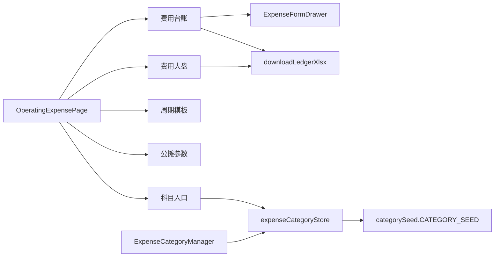

# 运营费用菜单重构 · 详细设计

> 2026-08-28 实施修订：本文关于保留固定 `OVERHEAD_RATE=35`、EAC 与现场费率分叉的限制已失效。现以 `finance-shared/overhead.ts` 动态公式和 `HubX/docs/2026-08-28-α公摊与差旅分类收口日志.md` 为准，其余界面规格继续有效。

| 字段 | 内容 |
|---|---|
| 作者 | HubX 设计 |
| 日期 | 2026-08-21 |
| 状态 | Draft |
| 路由 | `/finance/expenses` |
| 代码根 | `HubX/packages/ui/src/app/pages/operating-expense/` |
| grill | `计划/当前/operating-expense-restyle.md` |
| PRD | `文档/PRD/PRD-运营费用管理.md` v1.1 |
| 事实源 | `HubX/CONTEXT.md` §公司运营费用；ADR-0076～0085、0092、0093、0094 |

本文只定实现规格。**禁止**改 `overheadPool` / `hourlyOverheadRate` / `wma` / `forecastSlice` / `workdaysInRange` / `capacityHours` / `latestPayrollTotal` 的语义。页面只调纯函数。不写生产代码。开工切片见文末 **PR Plan**。

---

## Overview

现网 `/finance/expenses` 已有四 Tab 骨架与入账规则（阶段 A–E），但大盘只有 4 张 KPI + 费用池柱状图，模板 Tab 标题写成「固定模板」，抽屉用 `billingMonth-01` 冒充发生日，科目管理页仍是旧 5 个一级。这次 α UX 重构把页面做成五 Tab 经营看板：双口径头条、八层流式堆叠、两张直接支出排行、三条异动、台账导出、公摊公式条 + 只读结果表、系统科目入口。

账本规则不动。工资不进台账、不进公共运营池；本模块不自算项目毛利、不编成本项；科目仍是全公司那一棵两级树。公摊结果表保留合同标的与综合毛利率列，二者从精益已有派生**读取**；本模块只多算一列「工时 × 本页 `R_hour`」。

---

## Background & Motivation

### 现网事实（编码前核对）

| 点 | 现网 | 问题 |
|---|---|---|
| Tab | `OperatingExpensePage.tsx` 四 Tab：费用大盘 / 费用台账 / **固定模板** / 公摊参数 | 术语是「周期模板」；缺科目入口（ADR-0094） |
| 当前月 | `TemplateTab` / `OverheadTab` 用 `'2026-08'`；`DashboardTab` 用 `MONTHS[1]`（`2026-07`） | 大盘当前月 bug |
| 大盘 | 4 KPI（池 / `R_hour` / 编制工时 / 工资引用）+ `.expense-bar-chart` 柱 | 无口径切换、堆叠、排行、异动 |
| 抽屉 | 无发生日；`occurDate = billingMonth-01`；选项来自 `RECORDABLE_PRIMARY`（含 TRAVEL） | 能手录差旅 |
| 科目 | `categorySeed.ts` = 8 可录入 + LABOR；`ExpenseCategoryManager.tsx` 的 `initialCategories` = 旧 5 个一级 | 两套树 |
| 公摊接缝 | `finance-shared/overhead.ts` **只有** `OVERHEAD_RATE = 35`；精益 `mockCostItems` 的 `sourceType:'overhead'` 按 35 写死金额。`contractCostData.getHourlyOpCost` **已经**转调 `hourlyOverheadRate` | 结果表若读 35 会与本页 `R_hour` 分叉；不要再往 `overhead.ts` 塞 mock 依赖 |
| mock 台账 | 记录几乎只有 6～7 月 OFFICE + 一条差旅投影 `projectId:'project-001'`；无 `departmentId` | 滚动窗右侧空、排行空 |
| 工资 | `mockSalaryForOverhead` 5 人：`15000+12000+18000+10000+8000=63000`（钱七无 actual） | 可直接引用 |
| 导出 | 台账无导出；`exceljs` 已在 `apps/prototype` / `apps/web` | 复用动态 `import('exceljs')`，不新加重型库 |
| 权限 | 阶段 A 未做矩阵（ADR-0084 留阶段 E） | 页面可开即可；工资块不打 `***` |
| Context | `OperatingExpenseContext`，key `hubx-operating-expense-v1`，只包本页。`OperatingExpensePage` **已有** `useState('dashboard')` | 派生结果禁止写入 localStorage；异动跳转需把 `activeTab` 提升进 Context |
| 单测 | `__tests__/expenseMutations.test.ts`（含 calc 旧函数）、`workdayCalendar.test.ts` | 无独立 `expenseCalc.test.ts` |
| 公摊 Tab 预警阈值 | **没有** 0.30 控件 | 本迭代补只读展示，常量与异动共用 |

### 痛点

财务要在同一菜单看见「这个月公司要花多少钱」（含人力口径）和「运营费用本身涨没涨」（不含人力），并在产出 `R_hour` 的同一页看到摊到项目后的只读结果。现网把这些都省略或算错月。

---

## Goals & Non-Goals

### Goals

1. 五 Tab：费用大盘 / 费用台账 / **周期模板** / 公摊参数 / 科目入口。主操作按 Tab 分放，无全局工具栏。第五 Tab 与 `CategoryTab` 同一提交落地，不提前空挂。
2. 大盘双口径（ADR-0092）、八层流式、部门归口排行、项目直接支出排行、三条异动、当月台账导出。
3. 台账筛选变密；抽屉发生日与归属月分开；手工一级仅 `MANUAL_PRIMARY`。
4. 周期模板视觉对齐原型（表头、一键生成当月、调价历史）；行为沿用 `canGenerate` / `generateFromTemplate` / `adjustTemplatePrice`。
5. 公摊公式条（分母 = 编制工时）+ **本期就做**的只读公摊结果表（ADR-0093）：列含项目工时、人力成本、台账直接、工时×本页 `R_hour`、合同标的、综合毛利率、已分摊/未分摊。合同与毛利率从精益读取。
6. 科目 Tab 与 `categorySeed` / `ExpenseCategoryManager` 共用一份可写树（ADR-0094）。

### Non-Goals（grill 已锁，禁止重开）

- 改 `R_hour` / 入离职折算 / 模板不覆盖已入账 / 作废规则。
- 工资写入台账或堆叠成科目；部门当摊销对象。
- 本模块自算毛利（禁止 `composite = labor + ledgerDirect + hours×R_hour` 再除合同）、编成本项、改精益 `calc.ts` 函数体。
- 薪酬封账、合同付款来源；打车超标异动。
- 用项目交付排期当费用预测。
- 关账、反冲、真实后端、权限矩阵（阶段 E）。
- 改功能看板状态（编码完成后才勾 α「UX 优化」）。
- 改 `finance-shared/overhead.ts` 的依赖方向（不 import 运营费用 mock）。

---

## Proposed Design

### 0. 当前月与滚动窗口

新增 `opexConstants.ts`，**全模块唯一当前月**：

```ts
/** α 冻结「今天」。所有 Tab、抽屉默认值、异动逾期判定都读这里。 */
export const ALPHA_TODAY = '2026-08-21';
export const CURRENT_MONTH = '2026-08'; // ALPHA_TODAY.slice(0, 7)

/** 科目环比与公摊 Tab 底部共用，本迭代只读不编辑。 */
export const MOM_THRESHOLD = 0.30;

export const CATEGORY_SEED_VERSION = 1;

/**
 * 过去 3 + 当月 + 未来 3。
 * PRD §七预测窗口是 3+1+3；Tab 1 文案写「6 个月」以 §七为准，轴为 7 列。
 * 原型标题「6个月滚动视窗」但刻度是 2026.05–11，与此一致。
 */
export function rollingMonths(current = CURRENT_MONTH): string[] {
  // ['2026-05','2026-06','2026-07','2026-08','2026-09','2026-10','2026-11']
}

export function addMonth(ym: string, delta: number): string { /* YYYY-MM 加减 */ }

export function isFutureMonth(ym: string, current = CURRENT_MONTH): boolean {
  return ym > current;
}
```

禁止再写死 `monthlyStats[1]`。大盘 / 公摊 / 模板的「当月」一律 `CURRENT_MONTH`。

工天数展示读 `mockWorkdaysByMonth[month]`（与现网公摊分母一致）。阶段 C 的 `workdayCalendar.ts` 本迭代不替换 `capacityHours` 入参。公摊 Tab 底部「工天摘要」只读该表当前月（如 `2026-08 → 21`），并展示 `MOM_THRESHOLD`。

---

### 1. 页面结构



`OperatingExpensePage.tsx`：现网已有 `const [activeTab, setActiveTab] = useState('dashboard')`。本迭代把 `activeTab` / `setActiveTab` 与 `ledgerFilter` / `templateFocusId` **提升进 `OperatingExpenseContext`**，供异动与排行跳转。页面本身不再重复一份 tab state。

```ts
<Tabs activeTab={activeTab} onChange={setActiveTab}>
  <TabPane key="dashboard" title="费用大盘"><DashboardTab /></TabPane>
  <TabPane key="ledger"     title="费用台账"><LedgerTab /></TabPane>
  <TabPane key="template"   title="周期模板"><TemplateTab /></TabPane>  {/* 现网「固定模板」改回术语 */}
  <TabPane key="overhead"   title="公摊参数"><OverheadTab /></TabPane>
  <TabPane key="category"   title="科目入口"><CategoryTab /></TabPane>  {/* P6 才挂，P0–P5 保持四 Tab */}
</Tabs>
```

不在 `Card` / Tabs 外放「录入」「导出分析总表」。原型顶栏那两个按钮废弃。

#### 各 Tab 主操作

| Tab | 主操作（放该 Tab 内容区顶栏） | 不放 |
|---|---|---|
| 费用大盘 | 含人力 / 不含人力 `Radio`；导出当月已入账未作废 xlsx（调 `downloadLedgerXlsx`） | 录入 |
| 费用台账 | 录入费用；Excel 导入；导出当前筛选；「从模板补生成」切到周期模板 Tab | — |
| 周期模板 | 新建模板（α 禁用 + 提示「沿用 mock 五条」）；一键生成当月；行内生成 / 调价历史 | 导出 |
| 公摊参数 | 无写入。月份只读当前月 | 录入、导出 |
| 科目入口 | 新增二级（一级禁用）；LABOR 无写按钮 | 录入、导出 |

**派生计算结果不写入 localStorage。** 科目树用独立 key，见 §7。台账记录 key bump 为 `hubx-operating-expense-v2`，见 §8。

---

### 2. 数据流

```mermaid
flowchart TB
  subgraph sources [只读源]
    Payroll[mockSalaryForOverhead<br/>latestPayrollTotal = 63000]
    Ledger[ExpenseRecord[] Context]
    Tpl[RecurringExpenseTemplate[]]
    Emp[mockEmployeesForOverhead]
    WD[mockWorkdaysByMonth]
    LeanCost[mockCostItems]
    Cases[mockCases]
    Contract[getContract]
    LeanFn["deriveEac / deriveLifecycleMargin"]
  end

  subgraph calc [禁止改语义]
    Pool[overheadPool]
    Hours[capacityHours]
    Rate[hourlyOverheadRate]
    WMA[wma]
    FS[forecastSlice]
    Pay[latestPayrollTotal]
  end

  subgraph derived [本迭代新增]
    Tot[postedLedgerTotal]
    Attr[directByAttribution]
    Stack[categoryStack]
    NonFixed[nonFixedPostedByPrimary]
    RankD[rankByDepartment]
    RankP[rankByProject]
    Ano[detectAnomalies]
    Stream[buildStreamSeries]
    Read[buildOverheadReadModel]
  end

  Ledger --> Pool
  Ledger --> Tot
  Ledger --> Attr
  Ledger --> Stack
  Ledger --> NonFixed
  Ledger --> RankD
  Ledger --> RankP
  Ledger --> Ano
  Tpl --> FS
  Tpl --> Ano
  Tpl --> Stream
  Emp --> Hours
  WD --> Hours
  Pool --> Rate
  Hours --> Rate
  Payroll --> Pay
  Ledger --> Stream
  NonFixed --> Stream
  Pay --> Stream
  Rate --> Read
  LeanCost --> Read
  Cases --> Read
  Contract --> Read
  LeanFn --> Read
  Ledger --> Read
```

`buildStreamSeries` 自己按月调 `categoryStack` / `nonFixedPostedByPrimary` / 模板确定数，**不**经 `postedLedgerTotal` 再转一手。

---

### 3. 费用大盘

#### 3.1 KPI 卡

口径状态：`includeLabor: boolean`，默认 `true`。只存在页面 `useState`，不进 localStorage。

| 卡 | 公式 | 切不含人力时 |
|---|---|---|
| **头条 · 当月合计** | 含人力：`postedLedgerTotal + payroll`；不含：`postedLedgerTotal`。**只含已入账 posted，不含未生成固定模板** | **变**（去掉工资） |
| 公共运营池 | `overheadPool(records, CURRENT_MONTH)` | **不变** |
| 项目直接 | `directByAttribution(records, month, 'project')` | **不变** |
| 线索直接 | `directByAttribution(records, month, 'lead_channel')` | **不变** |
| `R_hour` | `hourlyOverheadRate(pool, capacityHours(...))` | **不变** |
| 工资引用 | `latestPayrollTotal(mockSalaryForOverhead)`，hint「最近已出账月 2026-05 合计 · 平移」 | 卡仍在，**不**打 `***` |

编制工时从大盘 KPI 撤到公摊公式条。

当月流式列会含「未生成固定模板补齐」，与头条不一致是 **有意的**。图例/tooltip 必须写「已入账 / 模板补齐 / WMA / 工资」；单测锁：模板未生成时 8 月 KPI ≠ 8 月 `StreamMonth.displayTotal`。

样式：扩展 `.expense-kpi-grid` 为「头条 + 5 支撑」。不引入新设计系统。

#### 3.2 拟议接口（全部新增，旧函数只被调用）

```ts
import type {
  ExpenseRecord, RecurringExpenseTemplate, ExpenseCategoryPrimary, Attribution,
} from './types';

export const STACK_PRIMARIES: ExpenseCategoryPrimary[] = [
  'OFFICE', 'BENEFIT', 'HR_ADMIN', 'OTHER',
  'TRAVEL', 'PROMOTION', 'BUSINESS', 'THIRD_PARTY',
]; // 与 RECORDABLE_PRIMARY 同序；不含 LABOR

export function isPosted(r: ExpenseRecord): boolean {
  return r.status === 'posted';
}

export function postedLedgerTotal(records: ExpenseRecord[], month: string): number {
  return records
    .filter(r => isPosted(r) && r.billingMonth === month)
    .reduce((s, r) => s + r.amount, 0);
}

export function directByAttribution(
  records: ExpenseRecord[],
  month: string,
  attribution: Attribution,
): number {
  return records
    .filter(r => isPosted(r) && r.billingMonth === month && r.attribution === attribution)
    .reduce((s, r) => s + r.amount, 0);
}

export function categoryStack(
  records: ExpenseRecord[],
  month: string,
): Record<ExpenseCategoryPrimary, number> {
  const out = Object.fromEntries(STACK_PRIMARIES.map(p => [p, 0])) as Record<ExpenseCategoryPrimary, number>;
  for (const r of records) {
    if (!isPosted(r) || r.billingMonth !== month) continue;
    if (r.categoryPrimary === 'LABOR') continue;
    if (out[r.categoryPrimary] !== undefined) out[r.categoryPrimary] += r.amount;
  }
  return out;
}

/** 该月 posted 中，排除「source==='template' 且模板 kind==='fixed'」。浮动模板确认后的 posted 仍计入。 */
export function nonFixedPostedByPrimary(
  records: ExpenseRecord[],
  templates: RecurringExpenseTemplate[],
  month: string,
): Record<ExpenseCategoryPrimary, number> {
  const fixedIds = new Set(
    templates.filter(t => t.kind === 'fixed').map(t => t.id),
  );
  const out = Object.fromEntries(STACK_PRIMARIES.map(p => [p, 0])) as Record<ExpenseCategoryPrimary, number>;
  for (const r of records) {
    if (!isPosted(r) || r.billingMonth !== month) continue;
    if (r.source === 'template' && r.templateId && fixedIds.has(r.templateId)) continue;
    if (r.categoryPrimary === 'LABOR') continue;
    if (out[r.categoryPrimary] !== undefined) out[r.categoryPrimary] += r.amount;
  }
  return out;
}

export interface RankRow {
  key: string;
  name: string;
  amount: number;
}

export function rankByDepartment(
  records: ExpenseRecord[],
  month: string,
  nameOf: (departmentId: string) => string,
): RankRow[] { /* group by departmentId，无 id 不进表，sort desc */ }

export function rankByProject(
  records: ExpenseRecord[],
  month: string,
  nameOf: (projectId: string) => string,
): RankRow[] { /* attribution==='project' 且 projectId 有值 */ }

export function includeLaborTotal(ledgerTotal: number, payroll: number, includeLabor: boolean): number {
  return includeLabor ? ledgerTotal + payroll : ledgerTotal;
}

/** 调用方传给 forecastSlice 的 recentPoolValues：近 3 个 < current 月的非固定模板池。 */
export function recentNonFixedPoolValues(
  records: ExpenseRecord[],
  templates: RecurringExpenseTemplate[],
  currentMonth: string,
): number[] {
  // 对 addMonth(current,-3)..addMonth(current,-1) 各算
  // overheadPool 口径下再扣固定模板行（或等价：pool 且 nonFixed）
}
```

`rankByDepartment` / `rankByProject` 对应 grill 的 `directByDepartment` / `directByProject`。可再导出：

```ts
export const directByProject = (records: ExpenseRecord[], month: string) =>
  directByAttribution(records, month, 'project');
```

#### 3.3 流式堆叠

**层序（底 → 顶）**

含人力时最底另加工资平移层，**不是科目**：

1. `PAYROLL`（仅 `includeLabor`）
2. 办公 `OFFICE`
3. 福利 `BENEFIT`
4. 人资行政 `HR_ADMIN`
5. 其他 `OTHER`
6. 差旅 `TRAVEL`
7. 推广 `PROMOTION`（图例禁止写「市场推广」）
8. 商务 `BUSINESS`（与差旅分列）
9. 第三方 `THIRD_PARTY`

**颜色**（写入 `globals.css`）：

| 层 | 变量 | 色 |
|---|---|---|
| 工资 | `--expense-stack-payroll` | `#165DFF` |
| 办公 | `--expense-stack-office` | `#722ED1` |
| 福利 | `--expense-stack-benefit` | `#0FC6C2` |
| 人资行政 | `--expense-stack-hr` | `#3491FA` |
| 其他 | `--expense-stack-other` | `#86909C` |
| 差旅 | `--expense-stack-travel` | `#F53165` |
| 推广 | `--expense-stack-promo` | `#FF7D00` |
| 商务 | `--expense-stack-biz` | `#F7BA1E` |
| 第三方 | `--expense-stack-tp` | `#00B42A` |

**SVG 算法（不依赖仓库外 HTML）**

新组件 `StreamStackChart.tsx`。按列 **绝对堆叠面积**（y 从基线向上累加），相邻月用直线连接上沿；**不做** ThemeRiver / 居中 streamgraph。

| 参数 | 值 |
|---|---|
| viewBox | `0 0 1000 250` |
| 列数 | 7（05–11） |
| 列中心 x | `80 + i * 140` → 80, 220, 360, 500, 640, 780, 920 |
| 基线 y | 215 |
| 顶 y | 26 |
| Now 线 | 当前月列中心（8 月 → x=500），`stroke #165DFF width 2 dash 4,4`；标签 `Now (8月)` |
| 过去/当月确定数 | `fill-opacity: 1` |
| 未来 WMA | `fill-opacity: 0.4` + `stroke-dasharray: 3,3` |
| 未来确定模板 / 工资平移 | 实色（opacity 1）但整体仍在 Now 右侧 |
| 空层 | 金额 0，高度 0，仍参与堆叠顺序与图例 |
| Y 缩放 | `displayTotal`（含工资若 includeLabor）的窗口最大值；全 0 则 1 |
| 图例 | 九层色块 + 名称；本迭代不交互隐藏 |
| 平滑 | 折线（`L`），不用贝塞尔，避免面积穿层 |

每层 path：对 i=0..6，底部 y 是其下各层之和映射，顶部 y 是含本层之和映射；相邻列直线相连，封闭回基线。

**未来月怎么填（禁止把预测写入台账）**

现网 mock 记录主要在 6～7 月。**不**为 9–11 月补 posted。右侧用预测切片：

```ts
export type StreamKind = 'actual' | 'current' | 'forecast';

export interface StreamLayer {
  key: ExpenseCategoryPrimary | 'PAYROLL';
  label: string;
  amount: number;
  fill: 'solid' | 'template' | 'wma' | 'payroll';
}

export interface StreamMonth {
  month: string;
  kind: StreamKind;
  layers: StreamLayer[];
  postedTotal: number;     // = postedLedgerTotal；当月 KPI 对齐这个
  displayTotal: number;    // posted + 当月未生成固定模板 + 未来 WMA + 含人力工资
  templatePad: number;     // 当月/未来：固定模板确定数（已入账的不重复计入 pad）
  wmaTotal: number;        // 仅未来月；科目 WMA 合计
  payroll: number;         // includeLabor ? 63000 : 0
  workdays: number;
  rHour: number;           // 见下
}

export function buildStreamSeries(args: {
  records: ExpenseRecord[];
  templates: RecurringExpenseTemplate[];
  months: string[];
  currentMonth: string;
  payroll: number;
  includeLabor: boolean;
  workdays: Record<string, number>;
  capacityHoursOf: (month: string) => number;
  poolOf: (month: string) => number;          // overheadPool
}): StreamMonth[]
```

分月规则：

- **过去月**：`categoryStack(posted)` 实色 + 可选工资。`templatePad=0`，`wmaTotal=0`。`rHour = hourlyOverheadRate(poolOf(m), hours)`。
- **当月**：posted 实色；`canGenerate` 仍为 true 的 **固定**模板按 `t.amount` 实色补在对应科目（不写台账）。**当月不算 WMA**。`displayTotal = postedTotal + templatePad + payroll?`。
- **未来月**：
  - 确定数实色 = 覆盖该月的 active 固定模板金额 + 已 posted 且 `billingMonth` 落在该未来月的记录。
  - WMA 半透 = 对该一级调用 `wma(近 3 个 < currentMonth 月的 nonFixedPostedByPrimary 值)`。缺月有几月用几月。**禁止**对完整 `categoryStack`（含房租）再 WMA。
  - 含人力时工资平移层实色。
- `wma` 入参顺序必须与现网一致：`slice(-3)` 后 0.5 打在数组第一项（较旧月）。禁止改 `wma` 语义。

**未来月 `rHour`（预测费率）**：只走 **池口径**，与 `forecastSlice` 对齐：

```
predPool = forecastSlice(templates, recentNonFixedPoolValues(...), payroll, month)
rHour = hourlyOverheadRate(predPool.templateTotal + predPool.wmaTotal, capacityHoursOf(month))
```

不含工资、不含项目/线索直接。Tooltip 标明「预测费率」。`forecastSlice` 的 `payroll` 入参仍传，但 **不加入预测池分子**（函数返回值里 payroll 分列，调用方不要加进 `templateTotal+wmaTotal`）。

Tooltip 四段：已入账 / 模板补齐 / WMA / 工资。不含毛利。

#### 3.4 异动（只三条）

新文件 `expenseAnomalies.ts`：

```ts
export type AnomalyKind = 'category_mom' | 'fixed_not_generated' | 'variable_overdue';

export interface Anomaly {
  kind: AnomalyKind;
  title: string;
  detail: string;
  jump: { tab: 'ledger' | 'template'; filter: Record<string, string> };
}

export function detectAnomalies(args: {
  records: ExpenseRecord[];
  templates: RecurringExpenseTemplate[];
  currentMonth: string;
  today: string;
  momThreshold?: number;   // 默认 MOM_THRESHOLD
}): Anomaly[]
```

伪代码：

```
threshold = MOM_THRESHOLD
prev = addMonth(currentMonth, -1)

# 1. 科目环比增幅 > 30%（只看 posted；下降不报）
for primary in STACK_PRIMARIES:
  a = categoryStack(records, currentMonth)[primary]
  b = categoryStack(records, prev)[primary]
  if b > 0 and (a - b) / b > threshold:
    emit category_mom → ledger { billingMonth: current, categoryPrimary: primary }

# 2. 固定模板本月未生成 — 一条模板一条异动
for t in templates where active && kind==='fixed' && 覆盖 current:
  if canGenerate(t, current, records):
    emit fixed_not_generated → template { templateId: t.id }

# 3. 浮动待确认逾期
for r in records where pending && source==='template':
  t = templates.find(r.templateId)
  if t?.kind !== 'variable': continue
  due = `${r.billingMonth}-${pad2(t.billingDay)}`
  if due < today:
    emit variable_overdue → ledger { status: 'pending', id: r.id }
```

不实现打车超标、差旅超标、报销待办、工天日历就绪告警。

跳转：Context 的 `setActiveTab` + `ledgerFilter` / `templateFocusId`。

#### 3.5 两张排行

左右分卡，禁止合成一张综合成本表。

**部门归口**：key=`departmentId`；名称 `OPEX_DEPARTMENTS`；无 `departmentId` 不进排行；列只有部门 + 当月直接支出。

**项目直接**：key=`projectId`；名称顺序：`mockCases.find(c => c.projectId===id)?.projectName` → `OPEX_PROJECT_NAMES` → `projectId`。项目管理 mock id `'1'`…`'8'` **不对齐**，本迭代不改。点行跳台账 `attribution=project&projectId=`。

#### 3.6 大盘导出

按钮调 `downloadLedgerXlsx(posted.filter(billingMonth===CURRENT_MONTH), filename)`。无工资行、无毛利列。口径开关不影响导出。

---

### 4. 费用台账

#### 4.1 筛选

| 筛 | 值 |
|---|---|
| 归属月 | 全部 / 滚动窗口各月，默认当前月 |
| 一级科目 | 全部 + `RECORDABLE_PRIMARY` 中文名（保留 TRAVEL 等供投影） |
| 归属 | 全部 / 公共池 / 项目 / 线索 |
| 来源 | 六种（无薪酬封账、无合同付款） |
| 作废 | 全部 / 未作废 / 仅作废。默认 `status !== 'voided'` |
| 搜索 | `expenseNo` / `handler` / `description` 包含 |

```ts
export const SOURCE_LABEL: Record<ExpenseSource, string> = {
  manual: '手工',
  template: '周期模板',
  excel: 'Excel',
  travel: '差旅',
  promotion: '推广',
  reimbursement: '报销',
};
```

列：单号、发生日、归属月、科目、归属、金额、来源、经办、状态、操作。

#### 4.2 导出

`exportLedger.ts`：

```ts
export const LEDGER_EXPORT_HEADERS = [
  '单号', '发生日', '归属月', '科目', '归属', '金额', '来源', '经办', '状态',
] as const;

export function ledgerExportRows(records: ExpenseRecord[]): (string | number)[][] { /* 9 列，无工资无毛利 */ }

export async function downloadLedgerXlsx(
  records: ExpenseRecord[],
  filename: string,
): Promise<void> {
  const ExcelJS = await import('exceljs'); // 同 EmployeeList.tsx
}
```

大盘与台账都只调这两个名字。`packages/ui` 不新加依赖。

#### 4.3 Excel 导入

现网无导入。本迭代做完整入口。

**文件**：`accept=.xlsx`，上限 **2 MB**，超限 `Message.error`。动态 `import('exceljs')` 读第一张表。

**表头（第 1 行，字符串必须全等，缺一拒收）**：

```
发生日, 归属月, 一级科目, 二级科目, 归属, 金额, 部门, 项目, 渠道, 备注
```

`一级科目` 填 code（`OFFICE`…）。`归属` 填 `pool` / `project` / `lead_channel`。部门/项目/渠道填 id，可空。

**校验（坏行进错误表，整批不写入直到全部合法或用户放弃）**：

| 规则 | 失败 |
|---|---|
| 发生日必填且 `YYYY-MM-DD` | 拒收该行；**禁止**默认 `billingMonth-01` |
| 归属月必填 `YYYY-MM`；若空可从发生日推导，发生日也空则拒 | |
| 一级 ∈ `MANUAL_PRIMARY` | TRAVEL/PROMOTION/BUSINESS/LABOR 拒 |
| 金额 > 0 数字 | |
| 归属 ∈ 该一级允许集合（同抽屉） | |
| `project` 必填项目 id 且 ∈ `projectOptions()` | |
| `lead_channel` 必填渠道 id 且 ∈ `OPEX_CHANNELS` | |
| 二级若填则必须是该一级 children | |

**预览 UI**：Modal 表（合法行 + 错误表「第 n 行：原因」）。确认后一次性 `source:'excel'`、`status:'posted'`、`handler:'当前用户'`、`isProjection:false`。`expenseNo = EXP-{YYYYMM}-{seq pad 3}`，seq 从当前 `records.length+1` 起。

#### 4.4 抽屉

```ts
export const MANUAL_PRIMARY: ExpenseCategoryPrimary[] = [
  'OFFICE', 'BENEFIT', 'HR_ADMIN', 'OTHER', 'THIRD_PARTY',
];
```

**不要改 `RECORDABLE_PRIMARY`。**

**按一级锁归属**：

```ts
export function allowedAttributions(primary: ExpenseCategoryPrimary): Attribution[] {
  switch (primary) {
    case 'THIRD_PARTY':
      return ['pool', 'project'];          // 禁止线索
    case 'OFFICE':
    case 'BENEFIT':
    case 'HR_ADMIN':
    case 'OTHER':
      return ['pool', 'project', 'lead_channel'];
    default:
      return [];                           // MANUAL 以外不可手录
  }
}

export function defaultAttribution(primary: ExpenseCategoryPrimary): Attribution {
  return 'pool';
}

export function projectOptions(): { id: string; name: string }[] {
  // mockCases.filter(c => c.projectId).map(...)
}

export function channelOptions(): { id: string; name: string }[] {
  return OPEX_CHANNELS;
}

export function departmentOptions(): { id: string; name: string }[] {
  return OPEX_DEPARTMENTS;
}
```

| 字段 | 规则 |
|---|---|
| 发生日 | 必填 DatePicker，默认 `ALPHA_TODAY`。改发生日后若用户未手改归属月，归属月跟随 `occurDate.slice(0,7)` |
| 归属月 | 必填，默认同发生日所在月 |
| 一级 | 仅 `MANUAL_PRIMARY`；submit 再 `assertManualPrimary` |
| 二级 | 当前一级 children，可空 |
| 金额 | > 0 |
| 归属 | 选项 = `allowedAttributions(primary)`，默认 `pool` |
| 项目 | `attribution==='project'` 必填，选项 `projectOptions()` |
| 渠道 | `attribution==='lead_channel'` 必填，选项 `OPEX_CHANNELS` |
| 部门 | 可选，归口标签 |
| 备注 | 可选 |
| 提交 | `status:'posted'`，`source:'manual'` |

禁止再用 `billingMonth-01` 冒充发生日（导入路径同样禁止）。

---

### 5. 周期模板

行为零改动，只补视觉与入口：

- Tab 标题「周期模板」（P6 前 Page 仍四 Tab 时就把这个标题改掉，可跟 P4）。
- 顶栏说明沿用现网一句。
- **一键生成当月**：凡 `canGenerate(t, CURRENT_MONTH, records)` 调 `generateFromTemplate`。
- 表头：名称、科目、周期、金额、生成日、开始月、归属、类型、状态、操作（生成本月 / 已生成、调价历史）。
- 调价历史 Drawer 列 `priceHistory`；调价走 `adjustTemplatePrice`。

---

### 6. 公摊参数

#### 6.1 公式条

```
R_hour = 公共运营池 ÷ 全公司当月在职编制工时
编制工时 = Σ (在职区间 ∩ 该月工天数) × 8
```

禁止文案写成人数 × 21 × 8。

| 字段 | 来源 | 进公式？ |
|---|---|---|
| 公共运营池 | `overheadPool(records, CURRENT_MONTH)` | 分子 |
| 编制工时 | `capacityHours(...)` | 分母 |
| 工天数 | `mockWorkdaysByMonth[month]` | 只展示 |
| 人数 | 当月 `workdaysInRange>0` 的员工数 | **只展示，不进公式** |
| `R_hour` | `hourlyOverheadRate(pool, hours)` | 结果 |

人数旁 hint：「展示用，费率不按人头」。8 月池目标见 §8（非零）。

保留「近 3 个月参数变化」+「当月员工折算明细」。

**底部（PRD Tab 4）**：只读「预警阈值 30%（`MOM_THRESHOLD`，本迭代不可编辑）」；只读工天摘要「2026-08 标准工天 21（`mockWorkdaysByMonth`）」。

#### 6.2 只读公摊结果表

新文件 `overheadReadModel.ts`。

**禁止**本模块自算 `composite = laborCost + ledgerDirect + hours×R_hour`，禁止 `margin = (合同-composite)/合同`。那是第二套损益。

列（grill / ADR-0093，全保留）：

| 列 | 怎么来 | 本模块是否新公式 |
|---|---|---|
| 项目工时 | 该 Case 当月 `sourceType==='overhead'` 的 `quantityDays * 8`；无 overhead 行 → **0**（不回退人工项，人工项现网没有 `quantityDays`） | 只读字段 × 8 |
| 人力成本 | 该 Case `costCategory==='labor' && status==='actual' && date.slice(0,7)===month` 的 `amount` 合计 | 过滤读取 |
| 台账直接 | 本台账 `attribution==='project'` 当月 posted，按 `projectId` | 本账本 |
| 工时×本页 R_hour | `hours * rHour`，`rHour` 来自页面传入的现场 `hourlyOverheadRate(pool, capacityHours)` | **本模块唯一新增列** |
| 合同标的 | `getContract(contractId)?.totalAmount ?? 0`（与精益 `CaseList` 同一接缝；`mockCases[].contractAmount` 为 undefined，禁止读它） | 读取 |
| 综合毛利率 | `deriveLifecycleMargin(contractAmount, deriveEac(该 Case 全部 costItems))` | **调用精益已有函数**，不改 `calc.ts` |

```ts
import { deriveEac, deriveLifecycleMargin } from '../financial-delivery/calc';
import { getContract } from '../financial-delivery/contractSeam';

export interface OverheadReadRow {
  projectId: string;
  projectName: string;
  caseId?: string;
  hours: number;
  laborCost: number;
  ledgerDirect: number;
  overhead: number;          // hours * rHour
  contractAmount: number;
  eac: number;               // deriveEac；不上屏，供 margin 与单测
  margin: number | null;     // deriveLifecycleMargin(contractAmount, eac)
}

export interface OverheadReadModel {
  month: string;
  rHour: number;
  pool: number;
  capacityHours: number;
  rows: OverheadReadRow[];
  allocated: number;         // Σ hours_i × rHour
  unallocated: number;       // max(0, pool - allocated)
  hoursOverflow: boolean;
}

export function laborCostInMonth(items: CaseCostItem[], month: string): number {
  return items
    .filter(i => i.costCategory === 'labor' && i.status === 'actual' && i.date.slice(0, 7) === month)
    .reduce((s, i) => s + i.amount, 0);
}

export function projectHoursInMonth(items: CaseCostItem[], month: string): number {
  return items
    .filter(i => i.sourceType === 'overhead' && i.date.slice(0, 7) === month)
    .reduce((s, i) => s + (i.quantityDays ?? 0) * 8, 0);
}

export function buildOverheadReadModel(args: {
  month: string;
  records: ExpenseRecord[];
  rHour: number;             // 页面算好传入，禁止函数内读 mockExpenseRecords
  pool: number;
  capacityHours: number;
  cases: Array<{ id: string; projectId?: string; projectName?: string; contractId?: string }>;
  costItems: CaseCostItem[];
}): OverheadReadModel
```

行集合：`mockCases` 中带 `projectId` 的（001/003/005）。点项目名 `navigate(/financial-delivery/cases/${caseId})`，无 caseId 则 `/finance/project-cost`。本页不编辑成本。

**人工跨月**：只看 `date` 所在月，不按 `date~endDate` 相交全额。夹具：`cost-003` date `2026-06-15` endDate `2026-07-15` amount 15000 → **只进 6 月人力成本，7 月 0**。

表底：

```
已分摊 = Σ (hours_i × R_hour)
未分摊 = max(0, 池 − 已分摊)
若 Σ hours_i > capacityHours：hoursOverflow=true，黄条
「项目工时合计超过编制工时，未分摊已钳制为 0；请核日报/工天。本模块不倒灌。」
```

不按比例压缩各行公摊。

**口径脚注（必须上屏）**：

> 综合毛利率读取精益 `deriveLifecycleMargin(合同标的, deriveEac(该 Case 成本项))`。EAC 内 overhead 金额：`cost-oh-001/002` 与新增 `cost-oh-103/105` 按占位 `OVERHEAD_RATE=35` 写入；**`cost-f005` 为锁 case-001 EAC=187474，amount 保持 1800，不等于 21×8×35=5880**。本列「工时×本页 R_hour」与上述 35 口径不是同一笔。本模块不把现场费率写回成本项，也不用现场公摊重算毛利。禁止把 f005 的 amount「修正」成 5880。

#### 6.3 `OVERHEAD_RATE` 接缝

**不改** `finance-shared/overhead.ts` 的 import 图。保留：

```ts
export const OVERHEAD_RATE = 35;
```

精益 `calc.ts` 继续从这里取 35。`financial-delivery/__tests__/calc.test.ts` 的 `OVERHEAD_RATE = 35` 必须绿。

结果表 `rHour` 由 `OverheadTab` 用 Context `records` 算出现场费率再传入。**不要**新增默认绑 `mockExpenseRecords` 的 `getLiveHourlyOverheadRate`，尤其不要放进 `finance-shared/overhead.ts`（会让精益入口拖上整份费用 mock）。

`contractCostData.getHourlyOpCost` 已转调 `hourlyOverheadRate`，本迭代不动。

---

### 7. 科目 Tab 与同一棵树

抽 `expenseCategoryStore.ts`。禁止第三套树。禁止把树塞进费用 Context。

**订阅**：`useSyncExternalStore`。`LedgerTab` / `ExpenseFormDrawer` / `TemplateTab` / `CategoryTab` / `ExpenseCategoryManager` 全部订阅。同页改二级，台账科目名立刻更新。系统页与费用页：store 在 `save` 时 `localStorage.setItem` + `notify`；另听 `window.storage` 以同步多标签。

**持久化格式（merge，禁止全量覆盖种子）**：

```ts
const CATEGORY_STORAGE_KEY = 'hubx-expense-category-v1';

interface CategoryPersist {
  seedVersion: number;          // CATEGORY_SEED_VERSION
  extraSecondaries: Array<{
    primaryId: string;
    id: string;
    name: string;
  }>;
  renamed: Array<{ id: string; name: string }>;  // 仅二级
}

export function loadCategories(): CategoryNode[] {
  // 1. structuredClone(CATEGORY_SEED)
  // 2. 读 persist；缺 key → 纯种子
  // 3. 把 extraSecondaries 挂到对应一级（id 冲突以种子为准，跳过）
  // 4. 应用 renamed（只改种子里已有或 extra 的二级 name）
}

export function saveExtraSecondary(primaryId: string, node: { id: string; name: string }): void
export function renameSecondary(id: string, name: string): void
```

单测：种子新增一个二级后，旧 persist 仍能看到该新二级（merge 而非 replace）。

**九个一级（含 LABOR）禁止**：新增、删除、改 id/code。`ExpenseCategoryManager` 不仅藏「新增一级」，编辑一级 / 删除一级按钮对 `level===1` 全部禁用（含非 LABOR 的八个）。LABOR 子目不可增改删。可录入八个一级可增改二级。

Manager 扁平字段映射：

| Manager | CategoryNode |
|---|---|
| id / code | id（一级 id=primary） |
| name | name |
| parentId | 一级 null；二级 = primary id |
| level | 1 / 2 |
| status | 一级恒 true；二级默认 true，本迭代不做停用持久化 |
| remark | 不进 persist；load 时空串 |
| order | 一级按 `CATEGORY_SEED` 序；二级种子序 + extra 追加 |

无「脱敏」列。差旅行默认归属文案：**「项目或线索（必选其一）」**，不是部门。

`CategoryTab` 与第五 Tab 同一 PR（P6）落地。P6 **必须同时**把 `LedgerTab` / `ExpenseFormDrawer` / `TemplateTab` 的 `CATEGORY_SEED.find` 换成 store hook，否则改了二级后台账科目名仍走种子。P2/P4 阶段允许继续读种子（当时还没有 extra 二级）。

---

### 8. Mock 补数与 localStorage

#### 8.1 台账 key bump

现网 `loadState` 读到 `hubx-operating-expense-v1` 就不再看新 `mockExpenseRecords`。α 开发机几乎一定有该 key。

**采用 bump**：`STORAGE_KEY = 'hubx-operating-expense-v2'`。不读 v1、不 merge 旧 records。旧 key 孤儿留着，清缓存可删。`loadState` 仍对读到的 v2 记录补 `occurDate`（缺则 `${billingMonth}-01`，仅迁移层；UI 录入/导入禁止这条默认）。

新 mock 里 **已知模板行写上 `departmentId`**（房租等 `dept-admin`），这样排行在新鲜 v2 下有数。

#### 8.2 8 月池目标（异动 #2 与非零 R_hour 同时成立）

四条固定模板（房租/物业/网络/飞书）**仍然不生成**。8 月池用非这些模板的 posted：

| id | 科目 | 归属 | 部门 | 金额 |
|---|---|---|---|---|
| `exp-benefit-202608` | BENEFIT / BENEFIT_TEAM | pool | dept-hr | 8000 |
| `exp-other-202608` | OTHER / OTHER_MISC | pool | dept-admin | 4000 |

**8 月 `overheadPool` 目标 = 12000**。编制工时 7 人足月 × 21 × 8 = **1176**（周十五 6/12 入职已满月；吴十六 9/20 离职，8 月仍在职）。**`R_hour` 目标 = 12000 / 1176 ≈ 10.2041**。公式条 / 结果表公摊列非零。

另（不进池）：

- `exp-promo-202608` PROMOTION 15000，`lead_channel`，`channelId:'ch-baidu'`（相对 7 月 10000 → +50%，异动 #1）
- `exp-tp-202608` THIRD_PARTY 8600，`attribution:'project'`，`projectId:'project-001'`，`departmentId:'dept-tech'`

异动 #2：四条固定 `canGenerate` 仍 true。异动 #3：现成 `exp-utilities-202607` pending。

#### 8.3 其余台账补数

```ts
export const OPEX_DEPARTMENTS = [
  { id: 'dept-admin', name: '行政部' },
  { id: 'dept-hr', name: '人事部' },
  { id: 'dept-tech', name: '技术部' },
  { id: 'dept-sales', name: '销售部' },
];

export const OPEX_CHANNELS = [
  { id: 'ch-baidu', name: '百度' },
  { id: 'ch-douyin', name: '抖音' },
  { id: 'ch-xhs', name: '小红书' },
];

export const OPEX_PROJECT_NAMES: Record<string, string> = {
  'project-001': '企业内部管理系统',
  'project-003': '在线教育平台',
  'project-005': '企业办公系统',
};
```

- 5 月：四条固定 OFFICE posted（与模板金额一致）+ `departmentId:'dept-admin'`，堆叠左侧有形。
- 6 月：现有 OFFICE 行补 `dept-admin`。可补 HR_ADMIN / PROMOTION / BUSINESS 及 BENEFIT/OTHER/THIRD_PARTY **小额** posted（只撑堆叠，不参与 8 月环比分母）。差旅投影在 7 月。
- 7 月（钉死，保证全量 mock 下 `category_mom` **仅 PROMOTION 一条**）：
  - 现有 OFFICE 行补 `dept-admin`；差旅投影补 `dept-tech`。
  - 推广 **10000** / `ch-baidu`（相对 8 月 15000 → +50%）。
  - 可补 HR_ADMIN / BUSINESS 小额（8 月这两科为 0，下降不报）。
  - **不补 BENEFIT、不补 OTHER**（上月 0 → `b>0` 不成立，8 月 8000/4000 不报增）。
  - **不补 THIRD_PARTY**（7 月 = 0；若日后要补必须 ≥ `8600/1.3 ≈ 6616`，否则 8 月项目 8600 会多一张环比）。
- **9–11 月不写 posted。**

#### 8.4 精益 8 月对齐（与公摊表同一 PR = P5）

改前 `deriveEac(case-001 全部项) = 187474`，`deriveEac(case-003) = 15000`（现网 mock 求和）。case-005 无成本项，EAC=0。

| id | 动作 | 目的 | EAC | 禁止改 amount |
|---|---|---|---|---|
| `cost-f001`…`cost-f004` | `status: 'forecast'` → `'actual'`（7500/7200/6750/2100） | 8 月人力成本 = 23550 | 不变 | 是（锁 EAC） |
| `cost-f005` | `sourceType: 'overhead'`，`quantityDays: 21`，`status: 'actual'`，**amount 保持 1800**（≠ 21×8×35=5880） | 8 月项目工时 = 168；金额只为锁 EAC | 不变 187474 | **是。禁止改成 5880** |
| `cost-f006`…`cost-f011` | 不动（仍 forecast） | — | 不变 | 是 |
| 新增 `cost-oh-103` | case-003，`sourceType:'overhead'`，`quantityDays: 10`，`amount: 2800`（=10×8×35），`date:'2026-08-01'`，actual | 003 有工时 | case-003 **15000→17800** | 按 35 写，不要改 quantityDays 而不改 amount |
| 新增 `cost-oh-105` | case-005，同样 overhead 8 月 `quantityDays: 8`，`amount: 2240` | 005 有行 | case-005 **0→2240** | 同上 |

`cost-oh-001/002` 的 35 历史 amount **不改**。

精益回归（P5 加在 `financial-delivery/__tests__/calc.test.ts` 或 lean mock 测试）：

```
deriveEac(case-001 items) === 187474   // 允许不变
deriveEac(case-003 items) === 17800    // 新期望
deriveEac(case-005 items) === 2240
OVERHEAD_RATE === 35
```

8 月 case-001：`laborCostInMonth=23550`，`projectHoursInMonth=168`，`overhead 列=168 * (12000/1176)`；`margin=deriveLifecycleMargin(205000, 187474)`（现场公摊列不进入该式）。

---

### 9. 文件清单（函数级）

| # | 文件 | 改动 | PR |
|---|---|---|---|
| 1 | `opexConstants.ts` **新** | `ALPHA_TODAY` / `CURRENT_MONTH` / `rollingMonths` / `MOM_THRESHOLD` / `CATEGORY_SEED_VERSION` | P0 |
| 2 | `types.ts` | `MANUAL_PRIMARY`；`RECORDABLE_PRIMARY` 不动 | P2 |
| 3 | `expenseCalc.ts` | 新增 `isPosted` `postedLedgerTotal` `directByAttribution` `categoryStack` `nonFixedPostedByPrimary` `recentNonFixedPoolValues` `rankByDepartment` `rankByProject` `includeLaborTotal` `buildStreamSeries`；**不改**既有 7 个函数体 | P0 |
| 4 | `expenseAnomalies.ts` **新** | `detectAnomalies` | P0 |
| 5 | `exportLedger.ts` **新** | `ledgerExportRows` `downloadLedgerXlsx` | P2 |
| 6 | `overheadReadModel.ts` **新** | `laborCostInMonth` `projectHoursInMonth` `buildOverheadReadModel` | P5 |
| 7 | `expenseCategoryStore.ts` **新** | persist merge + `useSyncExternalStore` | P6 |
| 8 | `StreamStackChart.tsx` **新** | SVG 绝对堆叠面积 | P3 |
| 9 | `DashboardTab.tsx` | 双口径、流式、排行、异动、当月导出 | P3 |
| 10 | `LedgerTab.tsx` | P2：密筛选、导出导入、录入（科目名仍可 `CATEGORY_SEED.find`）。**P6：去掉 `CATEGORY_SEED.find`，改订 store hook** | P2→P6 |
| 11 | `ExpenseFormDrawer.tsx` | P2：发生日；`MANUAL_PRIMARY`；按一级锁归属（二级选项可读种子）。**P6：二级选项改订 store hook** | P2→P6 |
| 12 | `TemplateTab.tsx` | P4：一键生成、调价历史（科目名仍可种子）。**P6：去掉 `CATEGORY_SEED.find`，改订 store hook** | P4→P6 |
| 13 | `OverheadTab.tsx` | 公式条、阈值/工天摘要、只读结果表 | P5 |
| 14 | `CategoryTab.tsx` **新** | 订 store；LABOR 只读；禁新增一级 | P6 |
| 15 | `OperatingExpensePage.tsx` | P4 改标题「周期模板」；P6 加第五 Tab；`activeTab` 改读 Context | P4/P6 |
| 16 | `OperatingExpenseContext.tsx` | key **v2**；`activeTab` `ledgerFilter` `templateFocusId`；occurDate 迁移 | P1/P3 |
| 17 | `mockData.ts` | 部门/渠道字典、5–8 月补数；不写 9–11 posted | P1 |
| 18 | `financial-delivery/mockData.ts` | §8.4 的 status/sourceType/新 overhead 行 | P5 |
| 19 | `ExpenseCategoryManager.tsx` | 订 store；禁增/改/删一级 | P6 |
| 20 | `finance-shared/overhead.ts` | **不改代码**（保留 35） | — |
| 21 | `styles/globals.css` | 堆叠色、流式容器、公式条、异动 | P3/P5 |
| 22 | `__tests__/expenseCalc.test.ts` **新** | 新派生；WMA 不双计；8 月 KPI≠displayTotal | P0 |
| 23 | `__tests__/expenseAnomalies.test.ts` **新** | 三条；无打车 | P0 |
| 24 | `__tests__/exportLedger.test.ts` **新** | 9 列无工资 | P2 |
| 25 | `__tests__/overheadReadModel.test.ts` **新** | 公摊用传入 rHour；margin 走 deriveLifecycleMargin；跨月人工 | P5 |
| 26 | `__tests__/expenseCategoryStore.test.ts` **新** | 拒增一级、拒改 LABOR、seed merge | P6 |
| 27 | `__tests__/expenseMutations.test.ts` | **不改断言** | — |
| 28 | `__tests__/workdayCalendar.test.ts` | 不动 | — |
| 29 | `financial-delivery/__tests__/calc.test.ts` | 保持 `OVERHEAD_RATE=35`；P5 加 EAC 新期望 | P5 |

`expenseService.ts` 不改。`IExpenseService` 不扩。

---

### 10. 测试

```bash
cd HubX/apps/prototype && npx vitest run ../../packages/ui/src/app/pages/operating-expense/__tests__
cd HubX/apps/prototype && npx vitest run ../../packages/ui/src/app/pages/financial-delivery/__tests__/calc.test.ts
```

现有必须继续绿：`canGenerate` / `generateFromTemplate` / `adjustTemplatePrice` / `voidExpense` / `patchPostedExpense` / `confirmExpense` / `importTravelReimbursement` / `workdaysInRange` / `capacityHours` / `overheadPool` / `hourlyOverheadRate` / `wma` / `latestPayrollTotal` / `workdayCalendar` / `OVERHEAD_RATE = 35`。P0 夹具自备，不依赖 P1 mock 文件。

#### 新函数夹具与期望

**`postedLedgerTotal`**：posted pool 65000 + posted project 5000 + pending 4800 + voided 10000 + 他月 1000 → 当月 **70000**。

**`directByAttribution`**：`project` → 5000；`pool` → 65000。

**`categoryStack`**：OFFICE 65000 + TRAVEL 5000；LABOR 忽略。

**`nonFixedPostedByPrimary` + `buildStreamSeries`（Issue 2 锁死）**：6/7 月仅四条固定 OFFICE（35000+8000+2000+3000=48000），无其他 posted。9 月 OFFICE：`template` 层 = **48000**，`wma` 层 = **0**。禁止 96000。

**`rankByDepartment`**：dept-admin 100+200、无 id 的 pool 35000、dept-tech 5500 → admin=300, tech=5500；35000 不出现。

**`rankByProject`**：仅 project-001 posted 5500。

**`includeLaborTotal`**：70000+63000 true→133000；false→70000。

**`buildStreamSeries` 当月口径（Issue 8）**：current=08，四条固定未生成，posted 仅 BENEFIT 8000+OTHER 4000+推广 15000+项目 8600=35600。`postedTotal=35600`；`templatePad=48000`；`displayTotal`（不含人力）=83600。断言 `postedTotal !== displayTotal`。含人力再 +63000。

**`detectAnomalies`**：推广 7 月 10000 / 8 月 15000 → 一条 `category_mom`。办公下降不报。四条固定未生成 → 四条 `fixed_not_generated`。水电 pending + today 08-21 → `variable_overdue`。无第四种 kind。**全量 mock（§8.2+§8.3）下 `category_mom` 仅 PROMOTION 一条**：7 月 BENEFIT/OTHER/THIRD_PARTY 均为 0，8 月 8000/4000/8600 因 `b===0` 不报。

**`ledgerExportRows`**：9 列；无「毛利」「工资」表头。

**`laborCostInMonth`**：跨月夹具 date 06-15 / end 07-15 / 15000 → 6 月 15000、7 月 0。

**`projectHoursInMonth`**：只有 overhead `quantityDays`；人工项无该字段 → 不贡献工时。

**`buildOverheadReadModel`**：传入 `rHour=10.2041`、hours=168 → `overhead≈1714.3`，**不等于** `168*35`。`margin` 等于 `deriveLifecycleMargin(205000, 187474)`，不等于 `(205000-(labor+direct+overhead))/205000`。合同 0 → margin `null`。Σ hours>capacity → `unallocated===0` 且 `hoursOverflow`。

**`expenseCategoryStore`**：`addSecondary('LABOR')` throw；push 一级 throw；旧 persist + 新种子二级仍可见。

**`assertManualPrimary('TRAVEL')`** throw。

**`allowedAttributions('THIRD_PARTY')`** 不含 `lead_channel`。

---

## API / Interface Changes

无 HTTP。α 仍是 Context + localStorage。跨模块只读：

- `overheadReadModel` import `deriveEac` / `deriveLifecycleMargin` / `getContract` / `mockCases` / `mockCostItems`
- 项目名：`mockCases` + `OPEX_PROJECT_NAMES`
- **不**改 `finance-shared/overhead.ts`

---

## Data Model Changes

`ExpenseRecord` 字段不变。台账 key **`hubx-operating-expense-v2`**。科目 persist `{ seedVersion, extraSecondaries, renamed }`。精益只改 mock 行 status/sourceType/新增 overhead，不改 `CaseCostItem` 类型。

---

## Alternatives Considered

### A. 未来月补 posted mock vs 预测切片（采用切片）

补 posted 会污染池、`R_hour`、导出，与「预测不入账」冲突。

### B. 公摊列读成本项 amount vs 现场 `hours×R_hour`（采用现场）

ADR-0093 明文「工时×R_hour」。成本项 amount 是 35 占位。

### B2. 结果表毛利：自算综合 / 删列 / 只读精益派生（采用只读）

| | 自算 composite÷合同 | 删毛利列去跳转 | 读 `deriveLifecycleMargin`（采用） |
|---|---|---|---|
| grill 列 | 有毛利列但违规 | 缺列 | 列在，公式是精益的 |
| ADR-0093 | 第二套损益 | 弱于「只读引用」 | 符合「不自算、只读引用」 |
| 35 vs 现场 | 用现场重算会改毛利 | — | 毛利仍含 35；现场费率单独一列 + 脚注 |

不走「先改 ADR」。不删合同标的 / 综合毛利率列。

### C. CategoryTab 只改费用 Context vs `expenseCategoryStore`（采用 store）

Context 方案留下 Manager 旧 5 一级。

### D. recharts vs SVG（采用 SVG）

Now 轴 + 当月切分用 SVG。算法已写入 §3.3，不依赖 `~/Downloads` 文件。

### E. localStorage 原地 merge vs bump v2（采用 bump）

α 已有 v1 会盖住新 mock。bump 比按 id merge 更短、行为可预期。

### F. `getLiveHourlyOverheadRate` 放 `finance-shared` vs 不新增（采用不新增）

`getHourlyOpCost` 已转调；结果表用页面 `rHour`。避免精益入口拖费用 mock。

---

## Security & Privacy Considerations

阶段 A 无权限矩阵：能打开页面即能看工资合计 63000。不按行打 `***`。工资明细不进台账、不进导出。Excel 导入只接受 `MANUAL_PRIMARY`。无科目级脱敏。

---

## Observability

α 无后端。`Message` + 纯函数 `throw` + 工时溢出 `Alert`。不打远程日志。

---

## Rollout Plan

无 feature flag。α 按文末 **PR Plan** 分提交，**禁止**「页面 Tab 一次性换」。回滚：还原对应 PR；`OVERHEAD_RATE=35` 未改。编码完成后才勾看板 α「UX 优化」。

---

## Open Questions

无，grill 已收束。

---

## Key Decisions

| # | 决定 | 备选 | 为何 |
|---|---|---|---|
| 1 | 当前月冻结 `2026-08` / `ALPHA_TODAY=2026-08-21` | `new Date()`；继续 `MONTHS[1]` | 现网模板/公摊已用 08；`MONTHS[1]`=07 是 bug |
| 2 | 滚动窗 7 列 05–11（过去3+当月+未来3） | 6 列 | 以 PRD §七为准；原型轴也是 05–11 |
| 3 | 未来月 `buildStreamSeries` 画，不写 posted | 补未来 posted | 预测不入账 |
| 4 | WMA 输入 = `nonFixedPostedByPrimary`（排除固定模板） | 对完整 `categoryStack` 做 WMA | 否则房租双计 ≈96000 |
| 5 | `MANUAL_PRIMARY` 与 `RECORDABLE_PRIMARY` 分列 | 改 RECORDABLE | 筛选仍要差旅投影 |
| 6 | 池 / `R_hour` 与含人口径无关 | 含人力进池 | ADR-0092 / 0076 |
| 7 | 当月 KPI=`postedTotal`；流式 `displayTotal` 含模板补齐 | 头条也加模板 | PRD Now 轴要补齐，头条是已入账；tooltip 拆开 |
| 8 | 未来月预测费率 = `(forecastSlice.templateTotal+wmaTotal)÷编制工时` | 用堆叠各层之和 | 池口径，不含项目直接/工资 |
| 9 | 排行只用 posted 直接支出；无 `departmentId` 不进部门排行 | 无部门归「未分配」 | 部门不是落点 |
| 10 | 异动只三条；一条未生成模板一条卡片 | 合并一条 | 可跳到具体模板 |
| 11 | 导出 `ledgerExportRows` + `downloadLedgerXlsx`；复用 exceljs | 新库 / CSV | app 已有 exceljs |
| 12 | 导入缺发生日拒收，不用 `-01` | 默认月初 | 与抽屉一致 |
| 13 | 结果表毛利 = `deriveLifecycleMargin(getContract().totalAmount, deriveEac(items))`；本模块只多一列 `hours×R_hour` | 自算综合；删毛利列；先改 ADR | grill 要列；ADR-0093 禁止自算 |
| 14 | 工时只认 overhead `quantityDays*8`；人工按 `date` 所在月 | 相交全额；labor 回退工时 | 现网 labor 无 quantityDays；相交会双计 cost-003 |
| 15 | 8 月池=12000（BENEFIT 8000+OTHER 4000）；四条固定仍不生成；**7 月不补 BENEFIT/OTHER/THIRD_PARTY** | 7 月补成 ≥8000/≥4000/≥6616 | 同一快照三条异动 + 非零 R_hour；全量 mock 环比仅 PROMOTION |
| 16 | 精益 8 月：f001–f004 改 actual；f005 改 overhead+21 天；003/005 新增 oh 行 | 追加 actual 不删 forecast | f001–f005 的 EAC 不变；003/005 新期望写进单测 |
| 17 | `OVERHEAD_RATE=35` 留在 `finance-shared`；不新增转调函数 | 把 getLive 放 overhead.ts | 避免精益拖 mock；结果表用页面 rHour |
| 18 | 科目 `expenseCategoryStore` + `useSyncExternalStore` + `{seedVersion, extraSecondaries}` merge | Context 内存树；全量存树 | ADR-0078/0094；种子加二级不被旧 LS 盖住 |
| 19 | 九个一级禁增/改/删 | 只藏「新增」 | 否则 Manager 仍能删光八个可录入一级 |
| 20 | 台账 LS bump `hubx-operating-expense-v2` | 按 id merge v1 | 旧 v1 会挡住新 mock |
| 21 | `activeTab` 提升进 Context | URL search | Page 已有 state；异动需要 `setActiveTab` |
| 22 | 已分摊>池：未分摊钳制 0 + 警告 | 按比例压各行 | 不悄悄改项目数字 |
| 23 | 权限：页面可开即可 | 阶段 E 矩阵提前 | ADR-0084 |
| 24 | 看板本设计不勾 | 设计阶段勾「已实现」 | 编码完成后才勾 UX |

---

## PR Plan

取代「页面一次性换 Tab」。摘要与正文同一份。第五 Tab 在 P6 之前不要挂到 Page。P0 夹具自备。

| PR | 内容 | 依赖 |
|---|---|---|
| **P0** | `opexConstants` + 新派生纯函数（含 `nonFixedPostedByPrimary` / `buildStreamSeries` / `detectAnomalies`）+ 单测；不改页面 | — |
| **P1** | **仅** opex `mockData`（部门/渠道/5–8 月/归属；**7 月不补 BENEFIT/OTHER/THIRD_PARTY**）；Context key bump `v2` + occurDate 迁移 | P0 |
| **P2** | `MANUAL_PRIMARY` + 抽屉发生日/归属锁 + 台账密筛 + `exportLedger` + Excel 导入（预览/拒无发生日） | P0–P1 |
| **P3** | 大盘双口径 + SVG 流式 + 排行 + 异动（跳 P2 筛选）+ 当月导出；Context 提升 `activeTab` | P0–P2 |
| **P4** | 周期模板视觉 / 一键生成 / 调价历史；Page 标题改为「周期模板」 | P0 |
| **P5** | 公摊公式条 + 阈值/工天摘要 + 只读表 + **精益 8 月 mock 对齐**（与表同一提交） | P0、P1；lean mock 在本 PR |
| **P6** | `expenseCategoryStore` + `CategoryTab` + Manager 去旧 5 一级并禁删一级；`OperatingExpensePage` 加第五 Tab；**`LedgerTab` / `ExpenseFormDrawer` / `TemplateTab` 去掉 `CATEGORY_SEED.find`，改为 store hook** | 可与 P3 并行；store、Manager 与上述三处切 hook 必须同提交 |

验证（每 PR）：

```bash
cd HubX/apps/prototype && npx vitest run ../../packages/ui/src/app/pages/operating-expense/__tests__
```

P5 额外：

```bash
cd HubX/apps/prototype && npx vitest run ../../packages/ui/src/app/pages/financial-delivery/__tests__/calc.test.ts
```

---

## Risks

| 风险 | 严重度 | 缓解 |
|---|---|---|
| 旧 v1 localStorage 盖住新 mock | 高 | bump v2 |
| 精益 projectId 与项目管理 `'1'` 不对齐 | 中 | 排行/结果表只认 Case + `OPEX_PROJECT_NAMES` |
| 35 与现场 `R_hour` 两套数 | 高（误解） | 毛利走 deriveLifecycleMargin；现场费率单独列 + 脚注 |
| Manager 与 categorySeed 分叉 | 高 | P6 切 store，禁删一级 |
| 当月固定未生成 | 低 | 8 月池改走 BENEFIT/OTHER=12000 |
| 项目工时 > 编制工时 | 中 | 未分摊钳制 0 + Alert |
| 环比当月未完误报暴跌 | 低 | 只报增幅 > 30% |
| `importTravelReimbursement` 写 `leadId` 但 `ExpenseRecord` 无此字段 | 低 | 本迭代不修 |
| 科目全量 persist 覆盖新种子 | 中 | persist 只存 extra + renamed |
| 同页 CategoryTab save Ledger 不刷新 | 中 | `useSyncExternalStore` |

---

## References

- `计划/当前/operating-expense-restyle.md`（grill）
- `计划/当前/operating-expense-dev-plan.md`（A–E）
- `文档/PRD/PRD-运营费用管理.md` v1.1
- `HubX/CONTEXT.md` §公司运营费用
- ADR-0076～0085、0091～0094
- 视觉密度对照（非算法源）：仓库外原型 HTML；算法以本文 §3.3 为准
- 现网：`operating-expense/*`、`finance-shared/overhead.ts`、`financial-delivery/{calc,mockData,contractSeam}.ts`、`ExpenseCategoryManager.tsx`
